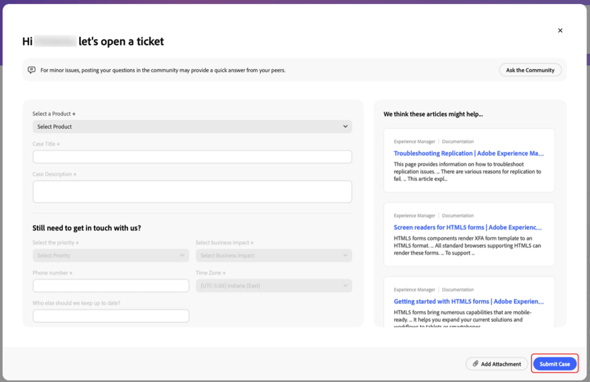

# Créer et gérer des cas dans le portail [!DNL Adobe Success]

Ce guide explique comment créer, afficher et télécharger des rapports pour les cas sur le portail [!DNL Adobe Success].

## Ouvrir un cas

Vous pouvez ouvrir un cas à partir de l’onglet Accueil ou de l’onglet **[!UICONTROL Assistance et informations]**.

Pour accéder à la page **[!UICONTROL Cas ouvert]** à partir de l’onglet Accueil, procédez comme suit :

1. Accédez à l’onglet Accueil.
1. Sélectionnez **[!UICONTROL Cas ouvert]**.

   

1. Renseignez les champs obligatoires :
   1. **[!UICONTROL Sélectionnez un produit]**.
   1. **[!UICONTROL Titre du cas]**.
   1. **[!UICONTROL Description du cas]**.
1. Sélectionnez **[!UICONTROL Soumettre le cas]**.

   

Pour accéder à la page **[!UICONTROL Cas ouvert]** à partir de l’onglet **[!UICONTROL Assistance et informations]**.

1. Accédez à l’onglet **[!UICONTROL Assistance et informations]**.
1. Sélectionnez **[!UICONTROL Cas ouvert]**.

   

Suivez les mêmes étapes que ci-dessus pour terminer et soumettre le cas.

## Afficher un cas

Vous pouvez afficher un cas à partir de l’onglet Accueil ou de l’onglet **[!UICONTROL Assistance et informations]**.

Pour accéder à la page **[!UICONTROL Afficher les cas]** à partir de l’onglet Accueil, procédez comme suit :

1. Accédez à l’onglet Accueil.
1. Sélectionnez **[!UICONTROL Afficher les cas]**.

   

1. Sélectionnez la fiche produit que vous souhaitez afficher, puis choisissez **[!UICONTROL Cas ouverts]** ou **[!UICONTROL Cas fermés]**.

   >[!NOTE]
   >
   >Vous pouvez également sélectionner l’onglet **[!UICONTROL Assistance et informations]** pour accéder rapidement aux fiches produits avec les liens **[!UICONTROL Cas ouverts]** ou **[!UICONTROL Cas fermés]**.

   

1. Cliquez sur le **[!UICONTROL Numéro de cas]** pour afficher les détails du cas.

   

## Télécharger des rapports de cas

Pour télécharger des rapports au format PDF sur vos cas, procédez comme suit :

1. Accédez à l’onglet Accueil.
1. Sélectionnez **[!UICONTROL Afficher les cas]**.

   

1. Sélectionnez la fiche produit que vous souhaitez afficher, puis choisissez **[!UICONTROL Cas ouverts]** ou **[!UICONTROL Cas fermés]**.

   >[!NOTE]
   >
   >Vous pouvez également sélectionner l’onglet **[!UICONTROL Assistance et informations]** pour accéder rapidement aux fiches produits avec des liens vers les **[!UICONTROL Cas ouverts]** ou les **[!UICONTROL Cas fermés]**.

   

1. Sur la page [Produit] - Cas d’assistance, cochez la case en regard du cas que vous souhaitez télécharger, puis sélectionnez **[!UICONTROL Télécharger les cas]**.

   
