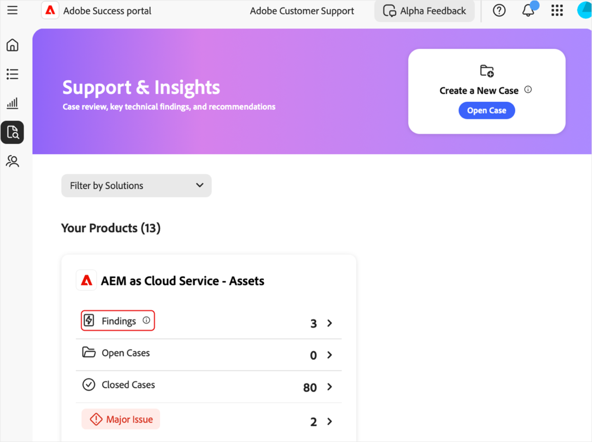
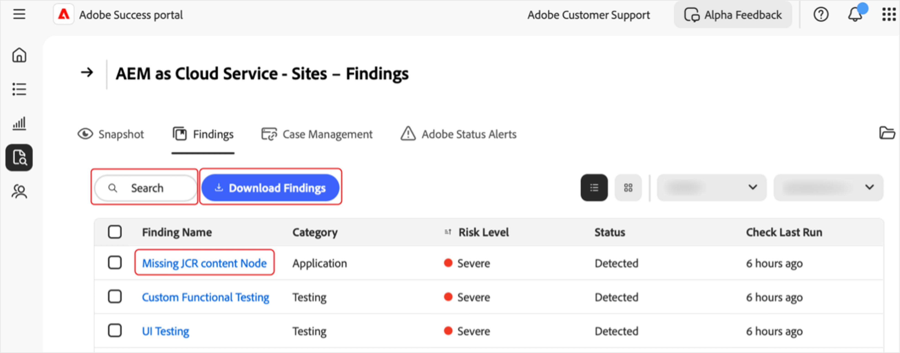

# Gérer des résultats sur le portail [!DNL Adobe Success]

Ce guide explique comment accéder à des résultats sur le portail [!DNL Adobe Success], les interpréter et agir sur ceux-ci pour vous aider à gérer de manière proactive les risques liés aux performances, à la sécurité et aux fonctionnalités des produits.

La page **[!UICONTROL Résultats]** du portail [!DNL Adobe Success] affiche les problèmes ou les risques détectés dans votre instance de produit Adobe. Les résultats incluent des problèmes de performances, de sécurité et de fonctionnalités, ainsi que leur statut et leur niveau de risque. La surveillance de cette page vous permet de résoudre les problèmes rapidement, avant qu’ils n’affectent vos environnements.

**Que sont les résultats ?**

Les résultats sont des alertes d’informations d’assistance affichées sur le portail [!DNL Adobe Success]. Ils mettent en évidence les problèmes potentiels liés à la configuration de votre produit Adobe, tels que des ralentissements des performances, des risques liés à la sécurité ou des configurations incorrectes. Ces alertes sont basées sur des données de télémétrie collectées à partir d’outils tels que des API, [!DNL New Relic] et [!DNL Splunk].

**Comment les résultats sont-ils créés ?**

Les équipes d’Adobe étudient régulièrement les problèmes et les tendances d’assistance les plus courants. En fonction des informations obtenues, elles ajoutent de nouvelles vérifications au système. Une fois par jour, le portail [!DNL Adobe Success] analyse les données des produits pour détecter les problèmes, tels que les configurations incorrectes, les traitements bloqués ou tout ce qui peut entraîner une panne du système. Si une vérification détecte un élément en dehors de la plage de sécurité (telle que définie par les équipes produit et d’assistance d’Adobe), il s’affiche sous la forme d’un résultat.

**Pourquoi les résultats sont-ils importants ?**

Un examen régulier des résultats permet de détecter les problèmes rapidement, avant qu’ils n’affectent votre système ou votre clientèle. Cette approche proactive améliore la stabilité du système, réduit les temps d’arrêt et suit les bonnes pratiques.

**Comment corriger les résultats ?**

Chaque résultat comprend des recommandations et des instructions claires sur la façon de résoudre le problème, ainsi que des liens vers la documentation pertinente, le cas échéant. Partagez ces résultats avec votre service informatique, votre équipe d’ingénierie ou votre partenaire Adobe, et travaillez ensemble pour les traiter. La résolution précoce de ces problèmes permet d’éviter des problèmes plus importants et de garantir le bon fonctionnement de votre système.

## Accéder aux résultats

Pour afficher des informations sur un produit :

1. Accédez à **[!UICONTROL Assistance et informations]**.
1. Sélectionnez la fiche produit correspondante. Sélectionnez l’onglet **[!UICONTROL Résultats]**.

   

1. Une liste de tous les résultats pour le produit sélectionné s’affiche.

   

1. Plusieurs possibilités sʼoffrent alors à vous :

   

   * Recherchez des entrées spécifiques.
   * Exportez la liste des résultats en sélectionnant **[!UICONTROL Télécharger les résultats]**. Pour exporter un rapport correspondant à un résultat, cochez la case en regard du résultat correspondant dans la colonne **[!UICONTROL Nom du résultat]**. Si vous ne sélectionnez pas de résultat, le PDF contient par défaut la liste de tous les résultats.
   * Afficher les détails d’un résultat, dont une résolution recommandée, en sélectionnant un résultat sous **[!UICONTROL Nom du résultat]**. La page Détails du résultat affiche le résultat sélectionné avec un contexte supplémentaire et une recommandation. Pour afficher ce rapport, sélectionnez la flèche de téléchargement.

     

## Résultats d’action

Suivez ces étapes pour vérifier si chaque résultat est toujours applicable ou peut être ignoré.

>[!NOTE] :
>
>Les vérifications standard sont exécutées sur vos instances. Si les vérifications ne détectent pas le problème dans votre instance, le statut indique **[!UICONTROL Non détecté]**.

1. Accédez à **[!UICONTROL Assistance et informations]**.
1. Sélectionnez la fiche produit correspondante.
1. Ouvrez lʼonglet **[!UICONTROL Résultats]**. Tous les résultats pour le produit sélectionné s’affichent.
1. Sélectionnez une entrée sous **[!UICONTROL Nom du résultat]**. Sur la page Détails du résultat, vous pouvez effectuer ce qui suit :
   * Sélectionner **[!UICONTROL Valider]** pour vérifier si le problème est toujours présent (le bouton **[!UICONTROL Valider]** est conçu pour confirmer que le problème a été résolu) :

   

   * Si le problème est toujours présent, le message suivant s’affiche : *[!UICONTROL Validation terminée. Résultat toujours détecté]*. Utilisez les informations et la recommandation de la page Détails du résultat pour examiner et résoudre le problème.
   * Si le problème n’est plus présent, le message suivant s’affiche : *[!UICONTROL Validation terminée. Le résultat n’est plus détecté]*. Lorsque le résultat n’est plus détecté, il devient grisé et passe au statut **[!UICONTROL Non détecté]**. Les résultats au statut **[!UICONTROL Non détecté]** se trouvent au bas de la liste des résultats.
   * Si le problème ne s’applique pas à vous ou ne vous concerne pas, vous pouvez l’ignorer en sélectionnant **[!UICONTROL Ignorer]**. Lorsque le résultat est ignoré, il devient grisé et passe au statut **[!UICONTROL Ignoré]**.  Les résultats au statut **[!UICONTROL Ignoré]** se trouvent au bas de la liste des résultats.

## Comprendre les résultats

* **[!UICONTROL Nom du résultat]** : sélectionnez pour obtenir des informations détaillées et les étapes de résolution recommandées.
* **[!UICONTROL Type]** : catégorisé comme *Fonctionnalité*, *Performances* et *Sécurité*.
* **[!UICONTROL Niveau de risque]** : indicateur de gravité, avec indicateurs visuels.
* **[!UICONTROL Statut]** : statut actuel du résultat (par exemple, *Détecté*, *Non détecté*, *Ignoré*).
* **[!UICONTROL Dernière exécution de la vérification]** : horodatage de la dernière vérification qui a mis à jour le résultat.

## Bonnes pratiques

La page **[!UICONTROL Résultats]** répertorie les recommandations avec les niveaux de risque suivants : **[!UICONTROL Haut]**, **[!UICONTROL Élevé]** et **[!UICONTROL Moyen]**. **[!UICONTROL Haut]** est critique, **[!UICONTROL Élevé]** est urgent et **[!UICONTROL Moyen]** n’est pas critique. Pour maintenir l’intégrité et les performances du site, procédez comme suit :

* Traitez rapidement les résultats à **[!UICONTROL Haut]** risque, car ils constituent des menaces critiques.
* Résolvez rapidement les problèmes à risque **[!UICONTROL Élevé]** afin d’éviter toute escalade.
* Surveillez régulièrement les résultats à **[!UICONTROL Moyen]** risque et agissez selon vos besoins.
