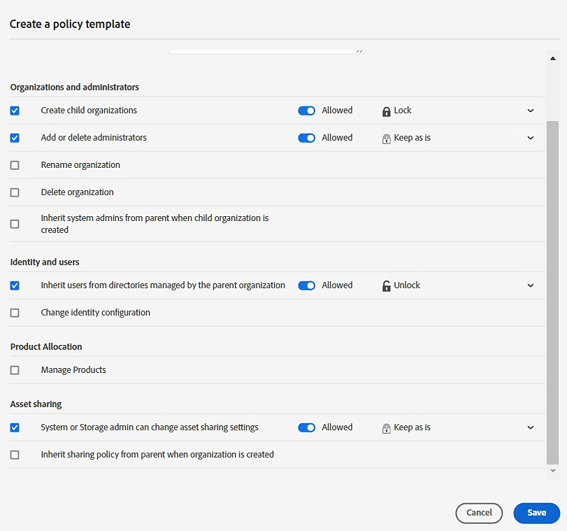
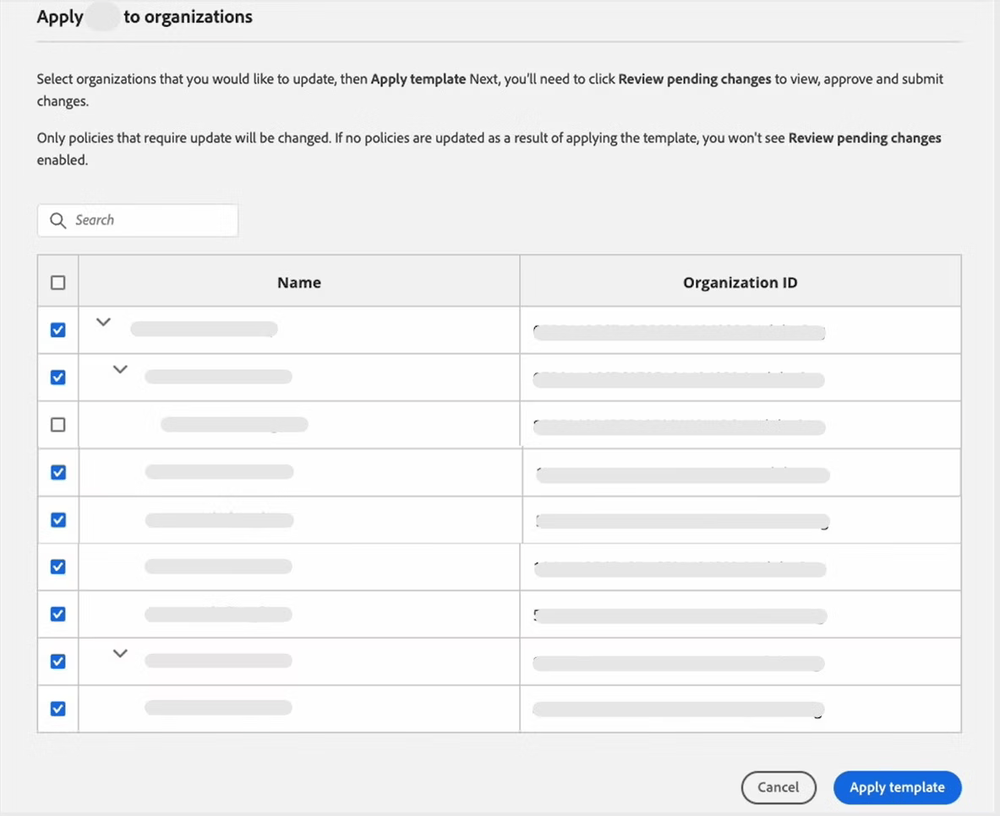

# Gestion des modèles de politique dans Global Admin Console

**S’applique à :** Entreprise

Découvrez comment les administrateurs globaux peuvent appliquer des modèles de politique à toute organisation enfant, directement ou indirectement, à partir de l’organisation où ils sont stockés dans le Global Admin Console.

>[!NOTE]
>
>Dans [&#128279;](https://helpx.adobe.com/enterprise/global-admin-console/adopt-global-administration.html), sélectionnez une organisation à modifier et accédez à l’onglet **Modèles de politique** pour rationaliser la configuration et faciliter une gestion cohérente des politiques entre les organisations.
>
> [Connexion au Global Admin Console](https://global-admin-console.adobe.com/)

## Fonctionnement des modèles de politique

Les modèles de politique sont stockés au sein d’une organisation et sont visibles par tous les administrateurs globaux de cette organisation. Une fois appliquées, les entrées du modèle de politique sont définies individuellement dans chaque organisation. Lorsqu’un modèle de politique est appliqué à une organisation, chacune des entrées du modèle de politique est appliquée aux politiques de l’organisation, remplaçant les valeurs de politique existantes.

### Comportement de la politique verrouillée

Les mises à jour des politiques verrouillées ne sont effectuées que si l’utilisateur appliquant la mise à jour est un administrateur global de l’organisation indiquée par l’icône **[!UICONTROL Verrouillé par]** de la politique mise à jour.

Si l’utilisateur appliquant le modèle est autorisé à déverrouiller la politique, les verrous de politique récupèrent les valeurs du modèle appliqué (verrouillé ou déverrouillé). Si le modèle indique que le verrou doit rester tel quel, la valeur du verrou dans la politique reste inchangée.

### Remarque importante sur l’enregistrement

>[!NOTE]
>
>Contrairement à d’autres modifications apportées à Global Admin Console, les modifications apportées aux modèles de politique prennent effet immédiatement sans avoir à passer par le processus **[!UICONTROL Révision des modifications en attente - Envoi]**. Toutefois, pour implémenter les modifications en attente dans les organisations où le modèle de politique est appliqué, la [soumission](https://helpx.adobe.com/enterprise/global-admin-console/execute-jobs.html) est requise.

## Création d’un modèle de politique

1. Dans le [&#128279;](https://global-admin-console.adobe.com/), sélectionnez une organisation à modifier, puis accédez à l’onglet **[!UICONTROL Modèles de politique]**.
1. Sélectionnez **[!UICONTROL Créer un modèle]**. 
   
    
1. Dans la boîte de dialogue **[!UICONTROL Créer un modèle de politique]**, saisissez le **nom** et le **description** du modèle de politique. Le nom du modèle de politique ne peut pas dépasser 100 caractères.
1. Sélectionnez les politiques à inclure dans le modèle.
1. Définissez des valeurs pour les politiques sélectionnées (voir [Définition des valeurs de politique](#setting-policy-values) ci-dessous).
1. Sélectionnez **Enregistrer**.

### Définition des valeurs de politique {#setting-policy-values}

Pour chaque politique incluse dans le modèle, configurez deux paramètres :

* **Autorisé/Non autorisé :** définissez le curseur sur la valeur souhaitée. En savoir plus sur [les détails de la politique](https://helpx.adobe.com/enterprise/global-admin-console/update-policies.html#policy-details).
* **Valeur de verrouillage :** modifiez l’état de verrouillage de la politique à l’aide de l’une des options suivantes :
   * **Verrouiller** — La politique sera verrouillée après l&#39;application du modèle.
   * **Déverrouiller** — La stratégie sera déverrouillée après l&#39;application du modèle.
   * **Conserver en l’état** — L’état de verrouillage de la politique restera le même qu’avant l’application du modèle. 
     
 

## Application d’un modèle à des organisations

1. Dans le [&#128279;](https://global-admin-console.adobe.com/), sélectionnez une organisation à modifier, puis accédez à l’onglet **[!UICONTROL Modèles de politique]**.
1. Sélectionnez l’icône **[!UICONTROL Plus d’options]**  pour le modèle de politique approprié, puis sélectionnez **[!UICONTROL Appliquer le modèle à l’organisation]**. 
   
    
1. Sélectionnez les organisations auxquelles vous souhaitez appliquer le modèle. Vous pouvez sélectionner plusieurs organisations. 
   
    
1. Sélectionnez **[!UICONTROL Appliquer le modèle]**.
1. Pour implémenter les modifications en attente dans les organisations où le modèle de politique est appliqué, sélectionnez **[!UICONTROL Vérifier les modifications en attente]**. Après la révision, sélectionnez **[!UICONTROL Envoyer les modifications]** pour les [exécuter](https://helpx.adobe.com/enterprise/global-admin-console/execute-jobs.html).

Si toutes les valeurs de politique dans les organisations que vous sélectionnez correspondent déjà aux valeurs du modèle, un message s’affiche pour vous informer qu’aucune modification n’a été apportée. En outre, l’option **[!UICONTROL Vérifier les modifications en attente]** n’est pas activée s’il n’y a aucune autre modification en attente.

## Modification d’un modèle

1. Dans le [&#128279;](https://global-admin-console.adobe.com/), sélectionnez une organisation à modifier, puis accédez à l’onglet **[!UICONTROL Modèles de politique]**.
1. Sélectionnez l’icône **[!UICONTROL Plus d’options]**  pour le modèle approprié, puis sélectionnez **[!UICONTROL Modifier le modèle]**. 
   
    
1. Mettez à jour le modèle de politique et sélectionnez **[!UICONTROL Mettre à jour maintenant]**.
1. Pour implémenter les modifications en attente dans les organisations où le modèle de politique est appliqué, sélectionnez **[!UICONTROL Vérifier les modifications en attente]**. Après la révision, sélectionnez **[!UICONTROL Envoyer les modifications]** pour les [exécuter](https://helpx.adobe.com/enterprise/global-admin-console/execute-jobs.html).

## Suppression d’un modèle

1. Dans le [&#128279;](https://global-admin-console.adobe.com/), sélectionnez une organisation à modifier, puis accédez à l’onglet **[!UICONTROL Modèles de politique]**.
1. Sélectionnez l’icône **[!UICONTROL Plus d’options]**  du modèle approprié, puis sélectionnez **[!UICONTROL Supprimer le modèle]**. 
   
    
1. Sélectionnez *Oui* dans la boîte de dialogue qui s’affiche.
