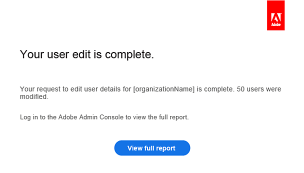
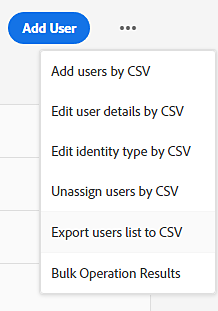

# Migrer des utilisateurs existants vers Adobe Admin Console

S’applique aux entreprises et aux équipes.

Ce document est destiné aux organisations disposant de licences Creative Cloud, Document Cloud et Acrobat existantes via un abonnement à un contrat de licence temporaire pour entreprise (ETLA) ou à un plan d’incitation à la valeur (VIP) qui migrent vers un programme d’achat ou un type de licence différent.

>[!NOTE]
>
>Si vous êtes en Amérique du Nord et que vous avez besoin d’aide pour le renouvellement annuel de votre contrat Adobe VIP auprès de votre gestionnaire de compte, envoyez un e-mail à l’adresse **renewalhelp@adobe.com** et nous vous contacterons sous peu.

Pour éviter toute interruption dans l’accès aux produits des utilisateurs et utilisatrices finaux, attribuez des licences dans Adobe Admin Console avant la fin de la période d’abonnement VIP existante.

* Pour les clients ETLA, prévoyez au moins 30 jours de chevauchement des produits. Effectuez la migration avant la date anniversaire afin que les utilisateurs et utilisatrices conservent l’accès aux applications et services Adobe. Pour les détails d’expiration du contrat ETLA, voir [Phases d’expiration automatisées des contrats ETLA](https://helpx.adobe.com/fr/enterprise/using/contract-expiry.html).
* Pour les clients VIP, achetez des licences avant votre date anniversaire et attribuez des licences avant la fermeture de la fenêtre de renouvellement pour le terme VIP actuel.
* Les clients CLP ou TLP peuvent migrer d’Acrobat sérialisé ou de Creative Suite vers des licences d’utilisateur nommé à l’aide des instructions de migration dans [Licences](https://helpx.adobe.com/fr/enterprise/using/licensing.html).

>[!NOTE]
>
>Si le type de licence de votre entreprise change, les utilisateurs finaux doivent se déconnecter de tout produit ou service Adobe et se reconnecter avec les mêmes informations d’identification.
>
>Pour les produits de bureau tels que Photoshop, Acrobat et Illustrator, utilisez les options Déconnexion et Connexion du menu Aide. Sur Adobe.com, utilisez l’icône dans le coin supérieur droit pour vous déconnecter, puis reconnectez-vous.

## Attribution rapide de licence (VIP vers VIP)

Les membres VIP actuels qui ont acheté Creative Cloud abonnement Entreprise ou Acrobat abonnement Entreprise (abonnement Entreprise) via VIP peuvent rapidement attribuer des licences pendant leur période de renouvellement grâce à l’attribution rapide de licence. Les clients éligibles répondent à des critères tels que les suivants.

* Les produits sont identiques

   1. La fenêtre de renouvellement est ouverte (30 jours avant ou après la date anniversaire du contrat VIP).
   2. Les produits d’entreprise de la commande sont de nouveaux SKU équivalents aux versions d’équipe du terme actuel.
   3. La quantité de commande de licence d&#39;entreprise est supérieure ou égale à la quantité de licence d&#39;équipe existante.

* Les produits ont une valeur supérieure

   1. La fenêtre de renouvellement est ouverte.
   2. Les produits d’entreprise de la commande sont de nouveaux SKU qui sont des produits de plus grande valeur que les produits de l’équipe au cours du terme actuel.
   3. La quantité de commande de licence d&#39;entreprise est supérieure ou égale à la quantité de licence d&#39;équipe existante.

* L’affectation rapide de licence n’est pas disponible lorsque

   * La quantité de licences d&#39;entreprise sur la commande est inférieure au nombre de licences d&#39;équipe existantes.
   * La commande concerne des produits d&#39;entreprise de valeur supérieure, mais la quantité de licence d&#39;entreprise commandée est inférieure à la quantité de licence d&#39;équipe existante.
   * La commande associe des produits d&#39;équipe et d&#39;entreprise, quelle que soit la quantité.
   * Le client a déjà acheté des produits d’équipe et d’entreprise avant la période de renouvellement.
   * Les SKU de renouvellement d’entreprise sont utilisés pour la nouvelle commande d’entreprise.
   * La commande de produit d’entreprise concerne un numéro d’accord VIP différent.
   * Les produits de l&#39;équipe actuelle incluent des éléments qui n&#39;ont pas de version d&#39;entreprise.

Une fois qu’Adobe a traité votre bon de commande d’entreprise, vous recevez un e-mail de confirmation contenant des instructions, notamment le jour où vous devez transférer les utilisateurs de licences d’équipe vers des licences d’entreprise dans Admin Console avant qu’ils ne perdent l’accès.

Dans Admin Console, vous êtes invité à attribuer des licences à l’aide de l’attribution rapide de licence :

1. Confirmez le nombre de licences à attribuer.

   

2. Vérifiez que les licences de produit d&#39;équipe dont l&#39;attribution est annulée correspondent aux licences d&#39;entreprise attribuées.

3. Vous recevez un e-mail une fois le processus terminé.

   

Téléchargez le [&#x200B; rapport de résultats &#x200B;](https://helpx.adobe.com/fr/enterprise/using/users.html#main-pars_header_1346350355) dans Admin Console pour vérifier que toutes les licences ont été attribuées. Si vous avez terminé avant la date indiquée dans votre e-mail de confirmation, les utilisateurs finaux ne doivent pas subir d’interruption de service.

Planifiez un appel d’intégration 1:1 avec un spécialiste de l’intégration Adobe (si vous ne l’avez pas déjà fait) pour en savoir plus sur Admin Console, y compris les [rôles administratifs](https://helpx.adobe.com/fr/enterprise/using/admin-roles.html) et [identité](https://helpx.adobe.com/fr/enterprise/using/identity.html).

>[!NOTE]
>
>L’affectation rapide de licence ne migre pas les utilisateurs avec des invitations en attente dans l’équipe Admin Console.

## Attribution de licences en bloc (VIP vers VIP)

Attribuez des licences avec une opération en bloc à l’aide d’un modèle CSV du [!DNL Admin Console] . Utilisez cette approche lorsque :

* Vous êtes un client VIP qui ne répond pas aux exigences d’attribution de licence rapide, ou
* Vous devez attribuer des licences en dehors de la fenêtre de renouvellement.

1. Une fois que vous avez accès à [&#128279;](https://adminconsole.adobe.com/enterprise) et que vos licences ont été ajoutées, accédez à **[!UICONTROL Utilisateurs]** > **[!UICONTROL Utilisateurs]**.
2. Cliquez sur  dans le coin supérieur droit de la page **[!UICONTROL Utilisateurs]**, puis choisissez **[!UICONTROL Modifier les détails de l’utilisateur au format CSV]**.
3. Dans la boîte de dialogue **[!UICONTROL Modifier les utilisateurs par fichier CSV]**, cliquez sur **[!UICONTROL Télécharger le modèle CSV]** et choisissez **[!UICONTROL Liste des utilisateurs actuels]**.

   

   Pour obtenir la description des champs du fichier téléchargé, voir [Format de fichier CSV](https://helpx.adobe.com/fr/enterprise/using/users.html#main-pars_header).
4. Ajoutez des attributions de licence au fichier CSV, puis faites glisser le fichier mis à jour dans la boîte de dialogue **[!UICONTROL Modifier les utilisateurs par CSV]** et cliquez sur **[!UICONTROL Télécharger]**. Vous recevez un e-mail une fois l’opération terminée.

   

Téléchargez le [rapport de résultats](https://helpx.adobe.com/fr/enterprise/using/users.html#main-pars_header_1346350355) pour valider les affectations. Planifiez ensuite l’intégration avec un spécialiste de l’intégration Adobe pour en savoir plus sur les [rôles administratifs](https://helpx.adobe.com/fr/enterprise/using/admin-roles.html) et [identité](https://helpx.adobe.com/fr/enterprise/using/identity.html).

## Attribution de licences en bloc (VIP vers ETLA)

Si vous disposez d’un abonnement VIP et que vous déplacez des utilisateurs vers ETLA, utilisez ce flux en bloc :

1. Connectez-vous à [&#128279;](https://adminconsole.adobe.com/enterprise) et ouvrez l’organisation qui contient vos utilisateurs VIP.
2. Accédez à **[!UICONTROL Utilisateurs]** > **[!UICONTROL Utilisateurs]**.
3. Cliquez sur  dans le coin supérieur droit, puis choisissez **[!UICONTROL Exporter les utilisateurs vers CSV]**.
4. Ouvrez l’organisation ETLA dans laquelle vous souhaitez que ces utilisateurs s’affichent.
5. Accédez à **[!UICONTROL Utilisateurs]** > **[!UICONTROL Utilisateurs]**.
6. Cliquez sur **[!UICONTROL Ajouter des utilisateurs par fichier CSV]**.
7. Cliquez sur **[!UICONTROL Télécharger le modèle CSV]**, puis ajoutez les utilisateurs VIP à partir du fichier CSV que vous avez exporté à l’étape 3.
8. Chargez le fichier CSV mis à jour.

Vous recevez un e-mail lorsque des utilisateurs sont ajoutés à l’organisation ETLA.

Téléchargez le [rapport de résultats](https://helpx.adobe.com/fr/enterprise/using/users.html#main-pars_header_1346350355) pour valider les affectations. Planifiez l’intégration avec un spécialiste de l’intégration Adobe pour les [rôles administratifs](https://helpx.adobe.com/fr/enterprise/using/admin-roles.html) et [identité](https://helpx.adobe.com/fr/enterprise/using/identity.html).

Pour les problèmes de téléchargement massif, voir [Résolution des problèmes de téléchargement massif des utilisateurs](https://helpx.adobe.com/fr/enterprise/kb/troubleshoot-bulk-user-csv-upload.html).

## Attribution de licences en bloc (ETLA vers VIP)

Si vous disposez d’un abonnement ETLA et que vous déplacez des utilisateurs vers VIP :

1. Connectez-vous à [&#128279;](https://adminconsole.adobe.com/enterprise) et ouvrez l’organisation qui contient vos utilisateurs ETLA.
2. Accédez à **[!UICONTROL Utilisateurs]** > **[!UICONTROL Utilisateurs]**.
3. Cliquez sur  dans le coin supérieur droit, puis choisissez **[!UICONTROL Exporter les utilisateurs vers CSV]**.

   

4. Ouvrez l’organisation VIP dans laquelle vous souhaitez que ces utilisateurs s’affichent.
5. Accédez à **[!UICONTROL Utilisateurs]** > **[!UICONTROL Utilisateurs]**.
6. Cliquez sur **[!UICONTROL Ajouter des utilisateurs par fichier CSV]**.
7. Cliquez sur **[!UICONTROL Télécharger le modèle CSV]**, puis ajoutez les utilisateurs ETLA à partir du fichier CSV que vous avez exporté à l’étape 3.
8. Chargez le fichier CSV mis à jour.

Vous recevez un e-mail lorsque des utilisateurs sont ajoutés à l’organisation VIP.

Téléchargez le [rapport de résultats](https://helpx.adobe.com/fr/enterprise/using/users.html#main-pars_header_1346350355) pour valider les affectations. Planifiez l’intégration avec un spécialiste de l’intégration Adobe pour les [rôles administratifs](https://helpx.adobe.com/fr/enterprise/using/admin-roles.html) et [identité](https://helpx.adobe.com/fr/enterprise/using/identity.html).

Pour les problèmes de téléchargement massif, voir [Résolution des problèmes de téléchargement massif des utilisateurs](https://helpx.adobe.com/fr/enterprise/kb/troubleshoot-bulk-user-csv-upload.html).

