# Expérience du service clientèle d’Adobe

## Tickets d’assistance pour Experience League

Les tickets d’assistance sont désormais envoyés via . Pour obtenir des instructions sur la manière d’envoyer un ticket d’assistance, consultez la section relative à la [envoi d’un ticket d’assistance](#create-a-support-ticket-with-experience-league).

Nous nous efforçons d’améliorer votre interaction avec le service clientèle d’Adobe. Notre vision est de rationaliser l’expérience d’assistance en passant à un point d’entrée unique, à l’aide d’Experience League. Une fois en ligne, votre entreprise pourra accéder facilement au service clientèle d’Adobe, bénéficier d’une plus grande visibilité sur votre historique de services via un système commun à tous les produits et demander de l’aide par téléphone, sur le web et par chat via un portail unique.

Si vous êtes un utilisateur d’Adobe Commerce, reportez-vous à la section [ Soumission d’un cas d’assistance ](https://experienceleague.adobe.com/en/docs/commerce-knowledge-base/kb/help-center-guide/magento-help-center-user-guide#support-case) dans le Guide d’utilisation de l’assistance Experience League pour Adobe Commerce.

## Prise en charge des rôles autorisés nécessaires pour la soumission de cas {#submit-ticket}

Pour envoyer un ticket d’assistance dans , le rôle d’administrateur de l’assistance doit vous être affecté par un administrateur système. Seul un administrateur système de votre entreprise peut affecter ce rôle. Le produit, le profil de produit et d’autres rôles administratifs ne peuvent pas attribuer le rôle d’administrateur de l’assistance et ne peuvent pas afficher l’option **[!UICONTROL Créer un dossier]** utilisée pour envoyer un ticket d’assistance. Pour en savoir plus sur les différents types de rôles d’administrateur et leurs droits, voir [Rôles d’administrateur](adobe-admin-console/admin-roles.md).

Si vous utilisez Commerce, le processus de partage de l’accès pour travailler avec les cas d’assistance est différent. Pour en savoir plus, reportez-vous à la section [Accès partagé : accorder des privilèges à d’autres utilisateurs pour accéder à votre compte](https://experienceleague.adobe.com/en/docs/commerce-knowledge-base/kb/help-center-guide/magento-help-center-user-guide#shared-access) dans le Guide d’utilisation de l’assistance Experience League pour Adobe Commerce.

### Ajout de rôles d’entités d’assistance à une organisation

Le rôle d’administrateur de l’assistance est un rôle non administratif qui a accès aux informations relatives à l’assistance. Les administrateurs de l’assistance peuvent afficher, créer et gérer des rapports d’événement.

Pour ajouter ou inviter un administrateur :

1. Dans Admin Console, choisissez **[!UICONTROL Utilisateurs]** > **[!UICONTROL Administrateurs]**.
1. Cliquez sur **[!UICONTROL Ajouter un administrateur]**.
1. Saisissez un nom ou une adresse e-mail.

   Vous pouvez rechercher des utilisateurs existants ou ajouter un nouvel utilisateur en spécifiant une adresse e-mail valide et en renseignant les informations à l’écran.

   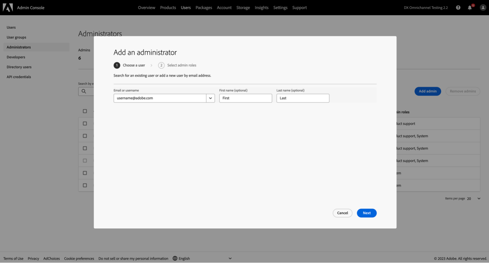

1. Cliquez sur **[!UICONTROL Suivant]**. Une liste des rôles d’administrateur s’affiche.

Pour attribuer un rôle d’administrateur de l’assistance à un utilisateur (permettre à un utilisateur de contacter l’assistance) :

1. Sélectionnez l’option **[!UICONTROL Assistance de l’administrateur]**.

   

1. Sélectionnez l’une des deux options suivantes :

   * Option 1 : **[!UICONTROL administrateur de l’assistance de base]**. Sélectionnez cette option si vous souhaitez donner à l’utilisateur ou à l’utilisatrice l’accès au support pour toutes les solutions (à l’exception de Marketo Engage).
   * Option 2 : **[!UICONTROL administrateur de l’assistance produit]** : sélectionnez cette option pour la prise en charge de Marketo Engage. Sélectionnez les instances Marketo Engage auxquelles accorder l’accès au support technique de l’utilisateur.

   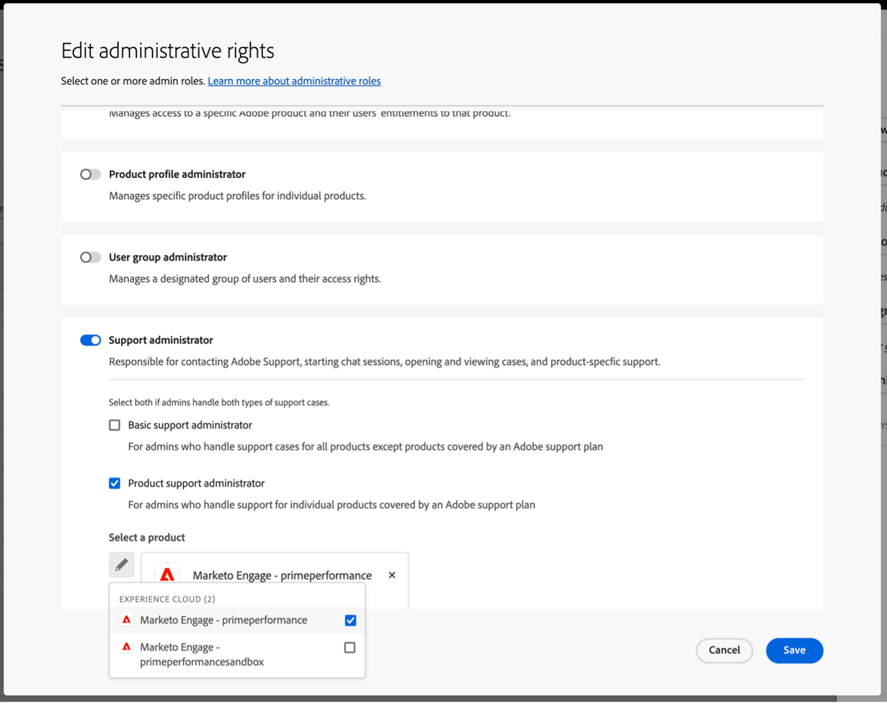

1. Une fois les sélections effectuées, cliquez sur **[!UICONTROL Enregistrer]**.

L’utilisateur reçoit une invitation par e-mail concernant les nouveaux privilèges d’administration de `message@adobe.com`.

Les utilisateurs doivent cliquer sur **Commencer** dans l’e-mail pour rejoindre l’organisation. Si les nouveaux administrateurs n’utilisent pas le lien **Commencer** dans l’invitation par e-mail, ils ne pourront pas se connecter à Admin Console.

Dans le cadre du processus de connexion, les utilisateurs peuvent être invités à configurer un profil Adobe s’ils n’en ont pas déjà un. Si plusieurs profils sont associés à leur adresse e-mail, les utilisateurs doivent choisir **Rejoindre l’équipe** (si vous y êtes invité), puis sélectionner le profil associé à la nouvelle organisation.

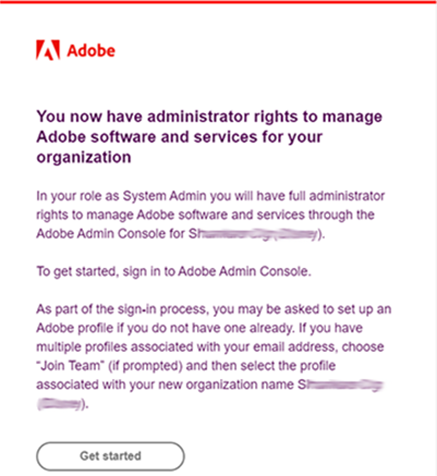

Pour plus d’informations, suivez les instructions [modifier le rôle d’administrateur d’entreprise](adobe-admin-console/admin-roles.md#add-enterprise-role) dans la documentation sur les rôles d’administration. Notez que seul un administrateur système pour votre organisation peut attribuer ce rôle. Pour plus d’informations sur la hiérarchie administrative, consultez la documentation [rôles administratifs](adobe-admin-console/admin-roles.md).

### Création d’un ticket d’assistance avec Experience League

>[!NOTE]
>
> Avant d’envoyer un ticket d’assistance, vérifiez les performances du système Adobe, la disponibilité et les problèmes connus sur le site [Statut d’Adobe](https://status.adobe.com/fr).

Experience League est un portail d’assistance en libre-service conçu pour fournir une assistance personnalisée et une expérience facile à utiliser pour les clients qui y ont droit.

1. Pour créer un ticket dans , sélectionnez l’onglet **[!UICONTROL Assistance]** dans la barre de navigation supérieure.

   

1. Dans le menu **[!UICONTROL Accueil]**, vous pouvez **[!UICONTROL Ouvrir un ticket d’assistance]**, **[!UICONTROL Afficher et gérer vos cas]**, **[!UICONTROL Demander un rappel]** ou accéder à des ressources de formation supplémentaires.

   L’option **[!UICONTROL Demander un rappel]** vous permet de planifier des réunions web avec partage d’écran pour les cas P2 et P3, ce qui permet de résoudre les problèmes plus rapidement et plus efficacement. Il est disponible pour Adobe Experience Manager, Admin Console, Adobe Journey Optimizer, Analytics, Audience Manager, Campaign, Commerce, Customer Journey Analytics, GenStudio, Marketo, Real-Time Customer Data Platform, Target et Workfront. Les réunions peuvent être programmées à la convenance du client. Il fournit également des rappels téléphoniques immédiats pour les cas P1 de tous les produits mentionnés ci-dessus, à l’exception d’Adobe Commerce.

   

1. Pour soumettre un dossier, sélectionnez **[!UICONTROL Ouvrir un ticket d’assistance]**. Vous pouvez également sélectionner le **[!UICONTROL Ouvrir le ticket]** dans le menu de la barre latérale.

   

### Remplissez le ticket d’assistance

Après avoir sélectionné **[!UICONTROL Ouvrir un ticket d’assistance]** ou **[!UICONTROL Ouvrir un ticket]**, le formulaire de création de dossier s’affiche.

Le formulaire utilise un workflow guidé à plusieurs étapes qui vous permet de fournir les informations nécessaires pour que l’assistance Adobe puisse résoudre efficacement votre problème. Vous pouvez parcourir le formulaire à l’aide des sections suivantes :

* Sélection de produits
* Description du problème
* Priorité et impact commercial
* Coordonnées et liste des observateurs
* Vérifier et envoyer

Vous pouvez également **basculer entre les sections** pour mettre à jour les informations avant d’envoyer le dossier.

Pour créer un ticket d’assistance, procédez comme suit :

1. Cliquez sur le nom du produit pour le sélectionner, puis cliquez sur **[!UICONTROL Suivant]**.

   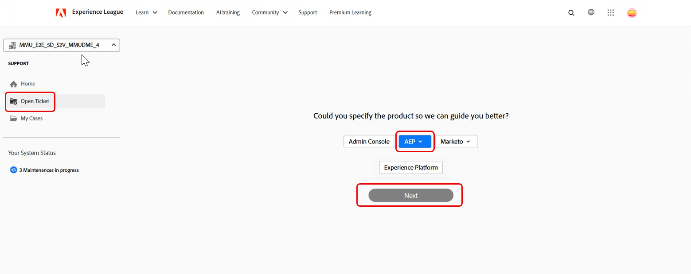

1. Dans la section **[!UICONTROL Description du problème]**, saisissez une description du problème. Le titre du dossier est généré automatiquement en fonction de la description du problème. Vous pouvez modifier le titre si nécessaire. Confirmez si le problème peut être reproduit. Sélectionnez **Oui** si le problème est reproductible. Une zone de texte s’affiche, dans laquelle vous pouvez décrire les étapes nécessaires pour reproduire le problème. Sélectionnez **Non** si le problème ne peut pas être reproduit de manière cohérente.

   

   Incluez des détails tels que :

   * Ce que vous essayez de faire
   * Ce qui ne fonctionne pas comme prévu
   * Étapes déjà effectuées
   * Si le problème est reproductible

   Lorsque vous saisissez la description du problème, Experience League affiche des recommandations optimisées par l’IA dans un panneau en regard du formulaire. Ces recommandations :

   * Suggérer une documentation pertinente ou des solutions connues
   * Permet de confirmer si le problème a déjà été résolu
   * Réduire la nécessité de soumettre un dossier pour les problèmes courants

   Le panneau de recommandation s’adapte au niveau de détail de la description de l’événement et s’affiche sans interrompre la création de dossier. Vous pouvez consulter les recommandations à tout moment et continuer à soumettre le dossier. Lorsque la description du problème **dépasse 50 caractères**, le système génère des recommandations optimisées par l’IA adaptées au problème.

   >[!NOTE]
   >
   >Les recommandations optimisées par l’IA n’apparaissent pas pour le produit Adobe Admin Console.

   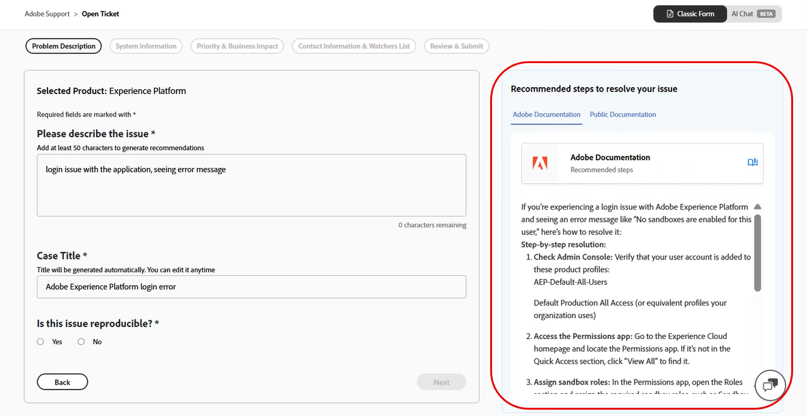

   Lorsque la description contient **moins de 50 caractères**, le système affiche les articles recommandés à titre indicatif. Un compteur de caractères intégré permet de suivre les exigences minimales en temps réel.

   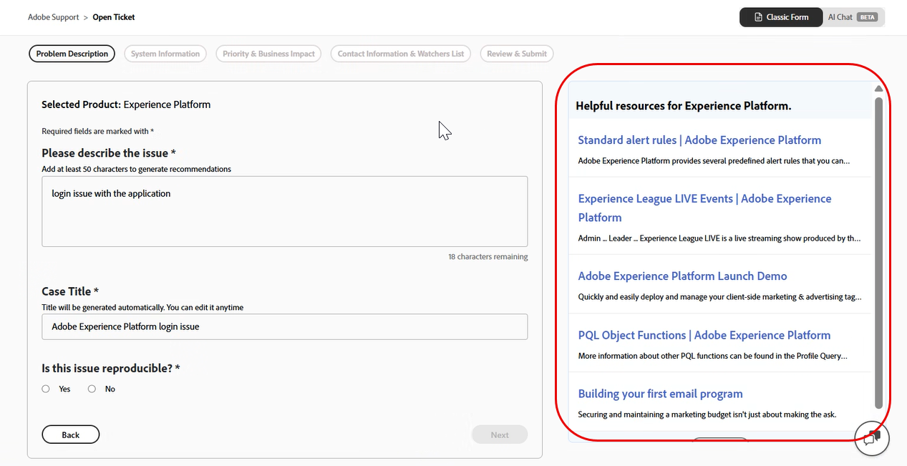

1. Cliquez sur **[!UICONTROL Suivant]**.

   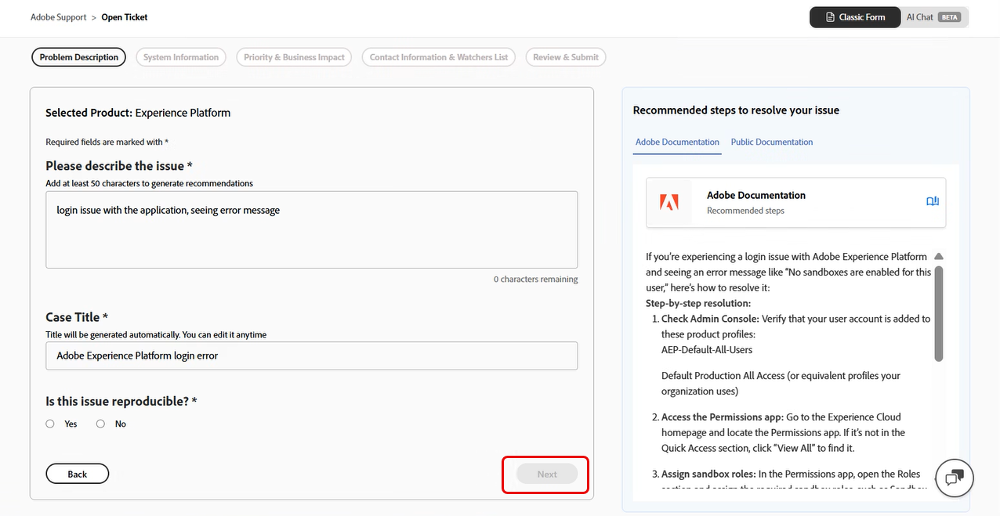

1. Dans la section **[!UICONTROL Informations système]**, indiquez les **[!UICONTROL Version du produit]**, **[!UICONTROL Environnement]**, **[!UICONTROL Offre du produit]** et indiquez si des modifications récentes ont été apportées à l’environnement ou à l’instance. Sélectionnez **Oui** pour fournir des détails supplémentaires sur les modifications. Sélectionnez **Non** si aucune modification n’a été apportée, puis cliquez sur **[!UICONTROL Suivant]**.

   >[!NOTE]
   >
   > Selon le produit sélectionné, des champs supplémentaires peuvent apparaître. Ces champs contiennent des détails sur l’environnement où le problème se produit.

   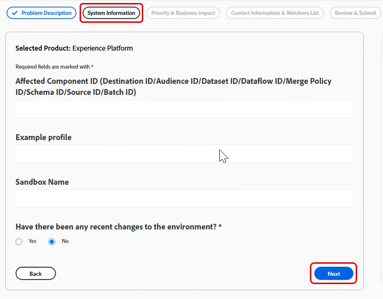

1. Dans la section **[!UICONTROL Priorité et impact commercial]**, sélectionnez les options suivantes :
   * Priorité des cas (P4 - mineur, P3 - important, P2 - urgent, P1 - critique)
   * Fournissez les détails de l&#39;impact commercial lorsque la priorité sélectionnée est P1 - Critique, puis cliquez sur **[!UICONTROL Suivant]**.

   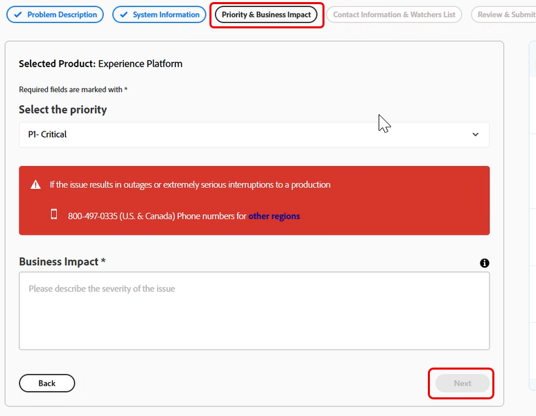

   Pour plus d’informations sur la manière dont la priorité de cas et l’impact commercial affectent les temps de réponse de l’assistance, voir [Temps de réponse initiaux ciblés pour l’assistance](https://experienceleague.adobe.com/en/docs/support-resources/data-sheets/overview#targeted-initial-response-times-for-support) dans la documentation sur les ressources des plans de réussite.

1. Dans la section **[!UICONTROL Informations de contact et liste des observateurs]**, sélectionnez le fuseau horaire, saisissez votre numéro de téléphone, ajoutez des observateurs, joignez des fichiers si nécessaire, puis cliquez sur **[!UICONTROL Suivant]**.

   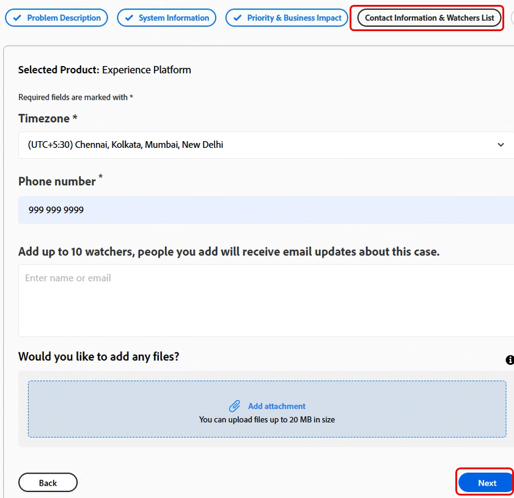

1. Dans la section **[!UICONTROL Réviser et envoyer]**, passez en revue les détails du dossier et cliquez sur **[!UICONTROL Approuver et envoyer le dossier]**.

   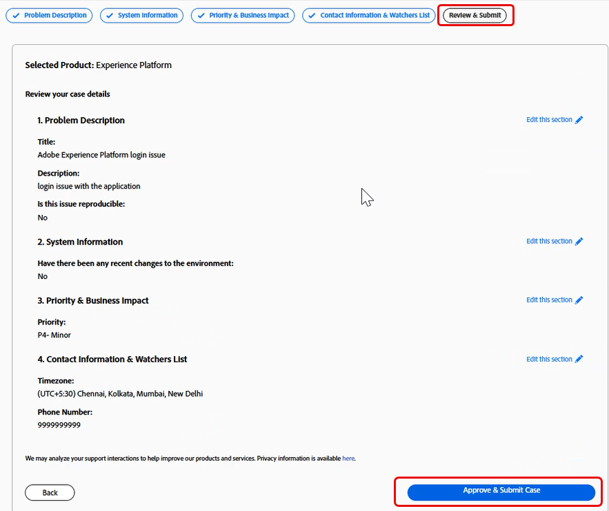

   L’étape **[!UICONTROL Vérifier et envoyer]** résume toutes les informations saisies et vous permet d’effectuer les opérations suivantes :

   * Examiner tous les détails de cas en un seul endroit
   * Revenez à l’une des étapes précédentes pour apporter des modifications
   * Revenir au résumé de la révision sans perdre la progression

Après l’envoi :

* Le cas est consigné dans Experience League
* Vous pouvez effectuer le suivi des mises à jour et communiquer avec l’assistance via le portail
* L’assistance Adobe réagit en fonction de la priorité et de l’impact que vous avez fournis

>[!TIP]
>
> Si vous ne voyez pas l’option **[!UICONTROL Ouvrir le ticket]** ou l’onglet **[!UICONTROL Assistance]**, contactez votre administrateur système pour affecter le rôle d’administrateur de l’assistance.

>[!NOTE]
>
> Si le problème entraîne des pannes ou de graves interruptions dans un système de production, un numéro de téléphone est fourni pour une assistance immédiate.

### Conversation avec l’IA dans l’expérience de création de cas

L’assistance Experience League fournit une interface de conversation optimisée par l’IA comme un autre moyen de créer et de gérer des cas d’assistance. L’expérience de chat dans l’IA est opt-in et ne remplace pas le workflow classique de création de cas.

>[!NOTE]
>
> Le chat par l’IA est actuellement disponible en version bêta. Le formulaire de création de dossier classique reste entièrement disponible et accessible à tout moment.

Pour accéder au chat avec l’IA, procédez comme suit :

1. Accédez à **[!UICONTROL Accueil]** et sélectionnez **[!UICONTROL Ouvrir un ticket d’assistance]**. Vous pouvez également sélectionner le **[!UICONTROL Ouvrir le ticket]** dans le menu de la barre latérale.

   

1. Cliquez sur le nom du produit pour le sélectionner, puis cliquez sur **[!UICONTROL Suivant]**.
1. Dans le coin supérieur droit, sélectionnez **[!UICONTROL Conversation IA]**.

   

Pour basculer entre **[!UICONTROL Formulaire classique]** et **[!UICONTROL Conversation IA]**, utilisez le bouton (bascule) dans le coin supérieur droit. Vous ne reporterez pas la progression actuelle lors du changement, mais les cas ou actions terminés ne seront pas affectés.

### Prise en main du chat IA

Lorsque vous ouvrez le chat IA, vous voyez les options suivantes :

* **[!UICONTROL Poser une question]**
* **[!UICONTROL Travailler sur un dossier existant]**
* **[!UICONTROL Ouvrir un nouveau dossier]**

  

Vous pouvez décrire le problème en saisissant dans le champ de texte ou en utilisant la transcription.

#### Poser une question

Sélectionnez **[!UICONTROL Poser une question]** pour obtenir des réponses instantanées aux questions relatives au produit, aux services Adobe et à l’assistance directement dans la conversation, sans avoir à ouvrir un dossier d’assistance.

L’IA s’appuie sur la base de connaissances d’Adobe pour fournir des réponses pertinentes, des liens vers la documentation et des solutions connues en fonction de votre requête.

Si l’IA ne parvient pas à résoudre votre requête directement dans le chat, elle vous guidera vers l’ouverture d’un nouveau dossier d’assistance pour vous connecter à l’équipe d’assistance d’Adobe.

#### Travailler sur un dossier existant

Sélectionnez **[!UICONTROL Travailler sur un cas existant]** pour gérer et obtenir des mises à jour sur vos cas d’assistance existants directement dans le chat.

L’IA affiche une liste de vos dossiers en cours. Vous pouvez vous référer à un cas par sa position dans la liste ou par son numéro de cas pour sélectionner le cas sur lequel vous souhaitez travailler.

Une fois le dossier sélectionné, vous pouvez :

* Demander un résumé
* Rechercher des mises à jour
* Prenez des mesures de suivi, telles que la transmission du cas ou la demande de rappel dans la même expérience de conversation.

#### Ouvrir un nouveau dossier

Sélectionnez **[!UICONTROL Ouvrir un nouveau dossier]** pour décrire votre problème avec vos propres mots au lieu de remplir des champs de formulaire structuré.

L’IA vous guide tout au long du processus de création de cas en vous posant des questions de suivi ciblées afin de rassembler les détails requis et d’adapter dynamiquement le flux en fonction de vos réponses.

L’IA collecte les informations requises, telles que :

* Détails du produit
* Type d&#39;événement
* Étapes de reproduction

Les champs facultatifs peuvent être ignorés si les informations ne sont pas immédiatement disponibles au moment de l’envoi.

Une fois que suffisamment d’informations ont été collectées, l’IA génère automatiquement un résumé structuré du cas en fonction de votre conversation, notamment :

* Titre du dossier
* Description
* Étapes de reproduction

Vous pouvez examiner le brouillon avant l’envoi pour vous assurer que tous les détails sont exacts. Vous pouvez également ajouter des pièces jointes, des journaux, des captures d’écran et d’autres détails supplémentaires à tout moment pendant ou après la conversation de création de dossier pour fournir à l’équipe d’assistance le contexte complet dont elle a besoin.
