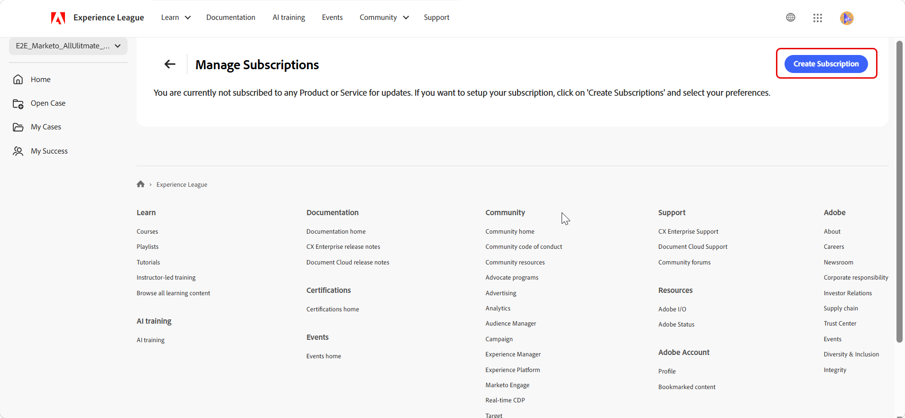
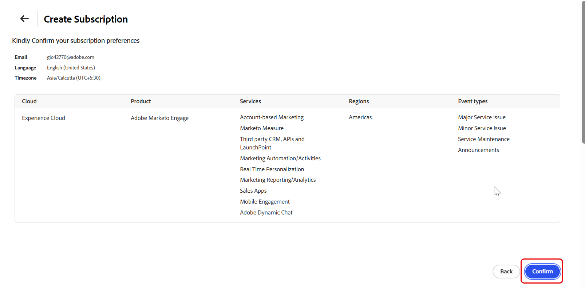
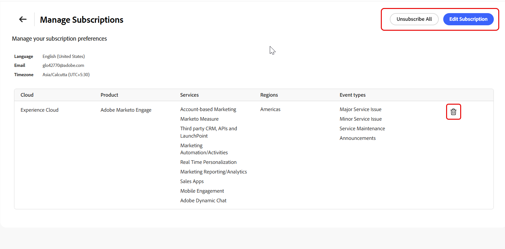

# Portail d’assistance Experience League - nouvelle interface utilisateur

## Vue d’ensemble

La nouvelle conception du portail d’assistance Experience League offre une expérience unifiée et intuitive de gestion des activités d’assistance Adobe. Il offre un accès plus rapide aux fonctionnalités essentielles, notamment le suivi des cas d’assistance, la surveillance de l’état des produits, l’accès aux informations sur les cas et la connexion à l’équipe de succès.

>[!NOTE]
>
>Pour créer et gérer des cas d’assistance dans le portail repensé, voir [Créer et gérer des cas d’assistance](exl-new-ui-support-cases.md).

## Page d’accueil

La page **[!UICONTROL d’accueil]** sert de hub central pour les activités d’assistance. Il offre un aperçu de l’environnement d’assistance et un accès rapide aux fonctionnalités clés.

Le panneau de navigation de gauche permet d’accéder aux sections suivantes :

- **[!UICONTROL Accueil]** s’ouvre en tant que page de destination par défaut et affiche une vue centralisée de l’activité d’assistance.
- **[!UICONTROL Ouvrir le dossier]** ouvre le workflow de création de dossier dans le portail repensé. Voir [Création et gestion des cas d’assistance](exl-new-ui-support-cases.md).
- **[!UICONTROL Mes incidents]** ouvre la liste des incidents dans le portail remanié. Voir [Création et gestion des cas d’assistance](exl-new-ui-support-cases.md).
- **[!UICONTROL Ma réussite]** est disponible uniquement pour les clients Ultimate Success plan.

## Changement d’organisation

Si plusieurs organisations sont associées, utilisez le sélecteur d’organisations **situé dans le coin supérieur gauche** portail.

Le changement d’organisation met à jour les données de cas, le statut des produits et les informations d’assistance sur le portail pour refléter l’organisation sélectionnée.

## Basculer entre les portails

Utilisez le bouton (bascule) du portail pour basculer entre le portail d’assistance Experience League repensé et le portail actuel.

Les deux portails restent synchronisés, ce qui garantit que les données de cas et les informations d’assistance restent cohérentes entre les expériences.

>[!NOTE]
>
>Les préférences du portail sont enregistrées automatiquement. Le portail que vous avez utilisé pour la dernière fois devient votre portail par défaut pour les prochaines connexions. Si vous avez utilisé le portail repensé pour la dernière fois, il s’ouvre directement sans charger l’ancien portail. Si vous avez utilisé le portail hérité pour la dernière fois, le système ouvre le portail hérité.

La page d’accueil d’comprend une bannière de bienvenue personnalisée avec une barre de recherche globale qui permet d’effectuer des recherches sur le portail d’assistance Experience League.

Les actions rapides suivantes sont disponibles en haut de la page **[!UICONTROL Accueil]** :

1. **[!UICONTROL Ouvrir un dossier de support]** — Ouvre le processus de création de dossier dans le portail repensé. Sélectionnez **[!UICONTROL Commencer]**.

1. **[!UICONTROL Afficher et gérer vos dossiers]** — Ouvre la page **[!UICONTROL Mes dossiers]** dans le portail remanié. Sélectionnez **[!UICONTROL Aller maintenant]**.

1. **[!UICONTROL Demander un rappel]** - Planifiez un appel concernant le cas avec un expert Adobe. Pour les cas P1 (critiques), demandez un rappel immédiat. Pour les cas P2 et P3, planifiez une réunion web avec un ingénieur d’assistance à une date et une heure opportunes. Sélectionnez **[!UICONTROL Demander maintenant]** pour commencer.

## Service Analytics

La section **[!UICONTROL Service Analytics]** affiche un résumé de l’activité des cas d’assistance. Utilisez le sélecteur de vue pour basculer entre **[!UICONTROL Mes dossiers]** et **[!UICONTROL Mes dossiers d’organisation]** :

- **[!UICONTROL Mes cas]** — Affiche les statistiques de cas spécifiques à l&#39;individu.
- **[!UICONTROL Mes cas d&#39;organisation]** — Affiche les statistiques de cas pour l&#39;organisation sélectionnée.

La vue sélectionnée s’applique à toutes les mesures et à tous les graphiques de cette section, y compris les sections [[!UICONTROL Comptage des cas par priorité]](#cases-count-by-priority) et [[!UICONTROL Mes cas envoyés]](#my-submitted-cases).

La section **[!UICONTROL Service Analytics]** fournit les mesures suivantes :

- **[!UICONTROL Cas de réponse en attente]** — Affiche le nombre de cas en attente d&#39;une réponse.
- **[!UICONTROL Cas soumis]** — Affiche le nombre total de cas soumis.

## Nombre de cas par priorité

Cette section affiche une répartition visuelle des cas d’assistance par niveau de priorité.

La sélection **[!UICONTROL Mes dossiers]** et **[!UICONTROL Mes dossiers d’organisation]** dans la section **[!UICONTROL Service Analytics]** s’applique à ce graphique et permet de l’afficher au niveau individuel ou organisationnel.

Pointez sur un segment prioritaire pour afficher une info-bulle qui affiche :

- Nombre total de cas pour ce niveau de priorité
- Nombre de dossiers ouverts
- Nombre de dossiers clôturés

## Mes dossiers soumis

Cette section affiche les trois cas d’assistance les plus récemment soumis, notamment :

- Identifiant du cas
- Titre du cas
- Priorité
- Date de soumission
- Statut

Lorsque l’option **[!UICONTROL Mes cas]** est sélectionnée dans **[!UICONTROL Service Analytics]**, cette section affiche les trois cas soumis les plus récemment. Lorsque **[!UICONTROL Mes cas d’organisation]** est sélectionné dans la section **[!UICONTROL Service Analytics]**, il affiche les trois cas soumis les plus récemment dans l’organisation.

Sélectionnez un **[!UICONTROL ID de cas]** pour afficher les détails du cas dans le portail d’assistance Experience League repensé.

Sélectionnez **[!UICONTROL Afficher tous les cas]** pour ouvrir la page **[!UICONTROL Mes cas]** dans le portail d’assistance Experience League repensé.

Lorsque **[!UICONTROL Mes incidents]** est sélectionné dans **[!UICONTROL Service Analytics]**, **[!UICONTROL Mes incidents (tous)]** est présélectionné et s’ouvre sur le portail d’assistance Experience League. Lorsque **[!UICONTROL Mes dossiers d’organisation]** est sélectionné, **[!UICONTROL Tous les dossiers de mon organisation)]** est présélectionné sur le portail d’assistance Experience League.

## Alertes de statut du produit

Cette section affiche l’état opérationnel actuel des produits Adobe affectés à l’organisation.

L’état **[!UICONTROL Disponible]** indique que le produit est entièrement opérationnel et qu’il ne subit aucune panne active. S’il existe un ou plusieurs problèmes, le nombre total de problèmes actifs s’affiche sur la carte produit.

Les produits apparaissent dans l’ordre suivant :

1. Produits présentant des problèmes actifs
1. Produits restants, classés par ordre alphabétique

Cette hiérarchisation permet d’identifier et de classer rapidement les produits qui nécessitent une attention particulière. Vous pouvez sélectionner une ou plusieurs cartes de produits pour filtrer les alertes dans **[!UICONTROL Vos alertes de statut du système]** sur la page **[!UICONTROL Accueil]**.

## Vos alertes d’état système

Cette section affiche des alertes en temps réel pour les produits Adobe. Vous pouvez filtrer les alertes par type d’événement à l’aide des onglets suivants :

- Majeur
- Mineur
- Potentiel
- Maintenance
- Annonces

De plus, chaque alerte comprend :

- Numéro de l&#39;événement
- Cloud
- Région
- Statut
- Heure de début et de fin pour votre référence

Sélectionnez une alerte pour développer et afficher des détails supplémentaires.

### Gérer les abonnements

Utilisez **[UICONTROL Manage Subscriptions]** pour configurer des notifications par e-mail pour les événements d’état de produit et de service Adobe. Les abonnements vous permettent de rester informé lorsqu’Adobe crée, met à jour ou résout des événements pour des produits et des régions sélectionnés.

1. Dans la section **[!UICONTROL Vos alertes de statut système]**, sélectionnez **[!UICONTROL Gérer les abonnements]**.

   

1. Sur la page **[!UICONTROL Gérer les abonnements]**, sélectionnez **[!UICONTROL Créer un abonnement]**.

   

1. Dans **[!UICONTROL Please Select Cloud]**, sélectionnez le cloud Adobe contenant le produit que vous souhaitez surveiller.
1. Dans **[!UICONTROL Please Select Product &amp; Offerings]**, sélectionnez le produit pour lequel vous souhaitez recevoir des notifications.
1. Dans **[!UICONTROL Veuillez sélectionner des régions]**, sélectionnez une ou plusieurs régions à surveiller.
1. Dans **[!UICONTROL Veuillez sélectionner des types d’événements]**, sélectionnez un ou plusieurs des types d’événements suivants :

   * Problème de service majeur
   * Problème mineur de service
   * Maintenance des services
   * Annonces

   

1. Vérifiez les paramètres de notification par défaut, y compris la langue et le fuseau horaire.
1. Sélectionnez **[!UICONTROL Continuer]**.
1. Passez en revue les détails de l’abonnement, y compris le cloud, le produit, les services, les régions et les types d’événement sélectionnés.
1. Sélectionnez **[!UICONTROL Confirmer]** pour créer l’abonnement.

   

1. Un message de confirmation s’affiche et l’abonnement est créé.

Une fois l’abonnement créé, Adobe envoie des notifications par e-mail lorsque des événements correspondant aux critères de produit, de région et de type d’événement sélectionnés sont créés, mis à jour ou résolus.

>[!NOTE]
>
>L’e-mail est le canal de communication par défaut pour les notifications de statut. Les préférences d’abonnement s’appliquent uniquement aux produits, régions et types d’événement sélectionnés.

La prochaine fois que vous ouvrirez **[!UICONTROL Gérer les abonnements]**, la page affichera les détails de votre abonnement actuel, y compris le cloud, le produit, les services, les régions et les types d’événements sélectionnés.

À partir de cette page, vous pouvez effectuer les actions suivantes :

* Sélectionnez **[!UICONTROL Modifier l’abonnement]** pour modifier un abonnement existant.
* Sélectionnez **[!UICONTROL Tout désabonner]** pour supprimer tous les abonnements.
* Sélectionnez l’icône de suppression en regard d’un abonnement pour supprimer un abonnement individuel.

## Informations sur votre plan

Cette section affiche des détails importants sur le plan d’assistance (Ultimate Success plan et Expert Success plan) et les avantages disponibles. Sélectionnez **[!UICONTROL En savoir plus]** pour explorer la gamme complète des offres de forfaits.

## My Success

La page **[!UICONTROL Ma réussite]** offre une vue personnalisée de l’engagement avec Adobe. Il offre un accès direct à l’équipe chargée du succès, aux avantages du programme et aux ressources d’apprentissage.

>[!NOTE]
>  
>Cette page est disponible uniquement pour les clients du plan ****.

La page comprend les éléments suivants :

- Message de bienvenue décrivant comment Ultimate Success fournit un leadership stratégique et une assistance technique proactive pour offrir des expériences digitales hautement performantes
- Une option **[!UICONTROL Regarder la vidéo]** pour en savoir plus sur le plan
- Les principaux éléments du plan sont les suivants :
  - **[!UICONTROL Équipe de réussite]**
  - **[!UICONTROL Accélérateurs de succès]**
  - ****

Il permet également d’accéder à des ressources de formation telles qu’Experience League, la communauté Experience League et les abonnements à l’apprentissage Premium.

### Équipe de réussite Adobe

Cette section présente votre équipe dédiée au succès d’Adobe. Sélectionnez **[!UICONTROL Contact]** en regard d’un membre de l’équipe pour envoyer un e-mail.

