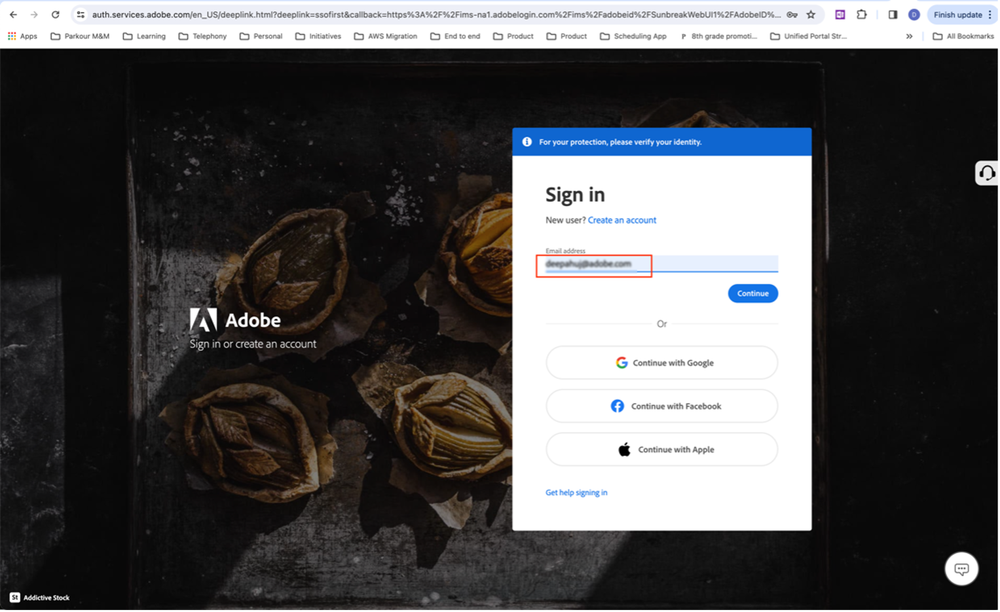
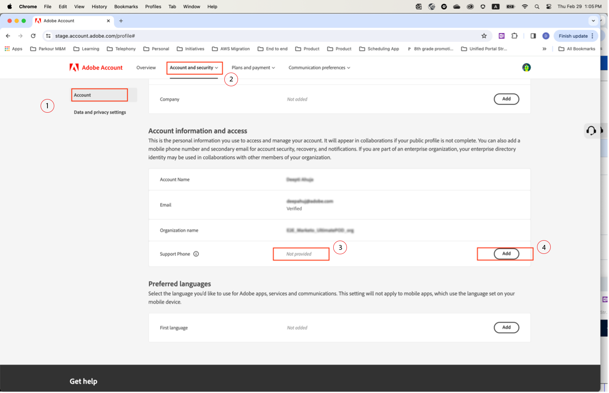

# Spécifier un numéro de téléphone d’assistance préféré

Lorsqu’un rôle **Admin** vous est attribué, tel que **Administrateur de l’assistance produit**, vous recevez un e-mail confirmant que vous disposez des autorisations d’administrateur pour gérer l’instance.

L’e-mail contient désormais le texte en rouge ci-dessous qui explique comment accéder à votre **[!UICONTROL profil de compte]** et partager avec nous votre numéro de téléphone d’assistance préféré.

Pour indiquer votre numéro de téléphone préféré :

1. Cliquez sur le lien **[!UICONTROL Profil du compte]** pour ouvrir une nouvelle fenêtre et vous connecter à l’aide de `account.adobe.com`.

   

1. Passez par le processus de connexion et accédez à l’écran ci-dessous sur `account.adobe.com`.
1. Sélectionnez **[!UICONTROL Compte et sécurité]** > **[!UICONTROL Compte]** pour afficher le champ Numéro de téléphone de l’assistance.
1. Ajoutez ici un numéro de téléphone que vous souhaitez que nous utilisions pour vous reconnaître en fonction de vos besoins en matière d’assistance.

