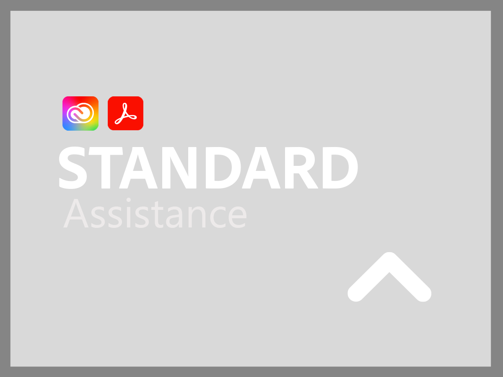
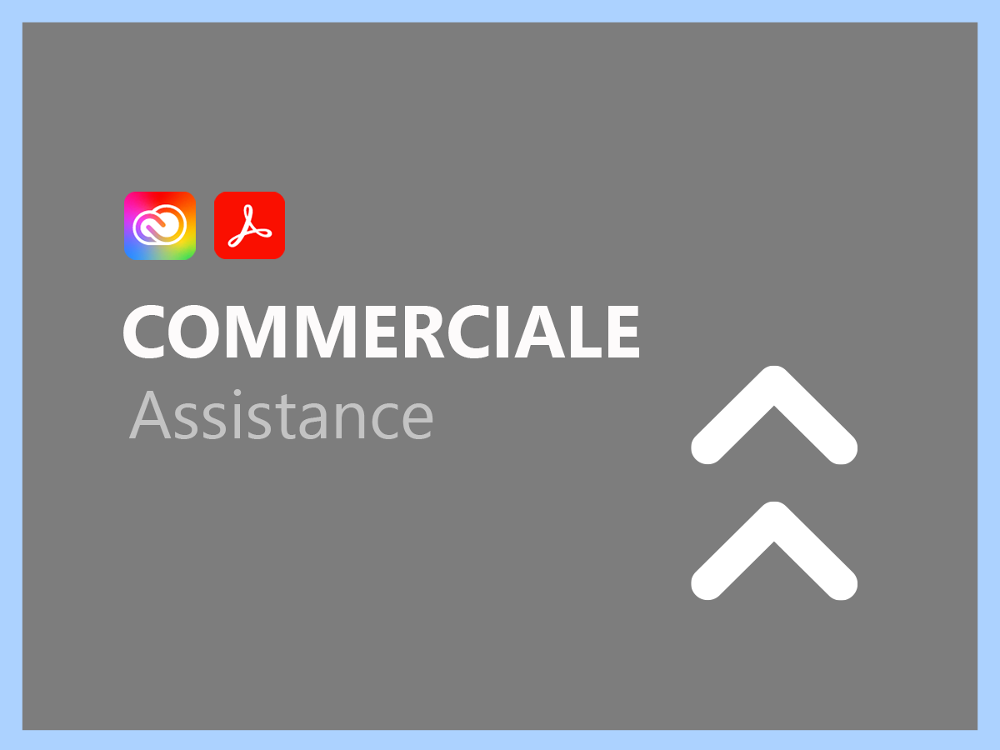
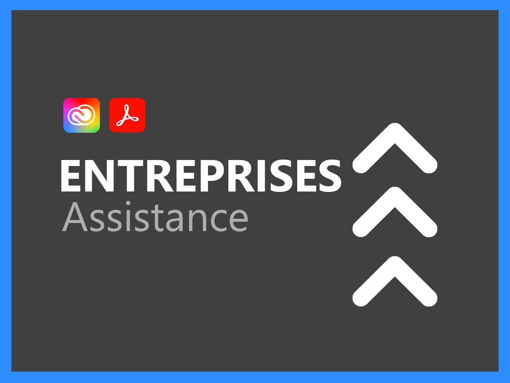
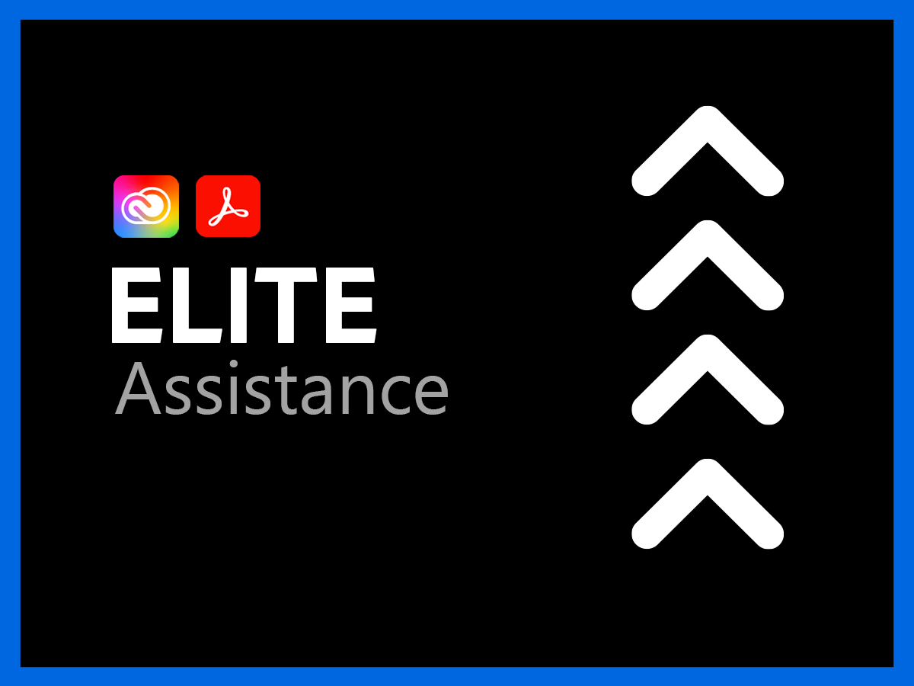

# Services d’assistance pour les entreprises et les Documents Cloud Creative Cloud

Le service dʼassistance clientèle dʼAdobe Creative Cloud et de Document Cloud est dévoué à votre succès. Toutes les applications comprennent un niveau d’assistance permettant un accès facile à nos ressources techniques hautement qualifiées pour l’assistance technique.

Pour répondre plus en profondeur aux besoins, nous proposons des services d’assistance Adobe comprenant l’accès à des professionnels d’assistance nommés et des sessions de tutorat proactif et d’examen du service. Peu importe la complexité de vos besoins en matière d’assistance, Adobe vous offre l’expertise technique et opérationnelle dont vous avez besoin pour atteindre des performances optimales et tirer le meilleur parti de votre solution Adobe.

<table style="table-layout:fixed">
<tr>
  <td>
    
    

    <a href="dme-standard.md"><strong>Assistance Standard</strong></a> (affichage) <a href="assets/DMeStandardSupportDatasheet_2022.pdf" target="_blank">PDF</a>)
    

    
Les utilisateurs autorisés (administrateurs) bénéficient dʼun accès 24 heures sur 24 et 7 jours sur 7 à nos équipes d’assistance technique, par chat ou par téléphone, ainsi que la possibilité dʼenregistrer des demandes d’assistance sur notre portail web dédié. 

     
  </td>
  <td>
    
    

    <a href="dme-business.md"><strong>Assistance commerciale</strong></a> (voir <a href="assets/DMeBusinessSupportDatasheet_2022.pdf" target="_blank">PDF</a>)
    

    
Routage prioritaire des cas d’assistance afin de garantir une prise en charge plus rapide par des agents expérimentés et la possibilité de faire appel à un responsable de compte pour recevoir des communications et des mises à jour régulières concernant vos demandes d’assistance les plus urgentes.

     
  </td>
</tr>
<tr>
  <td>
    
    

    <a href="dme-enterprise.md"><strong>Assistance Entreprise</strong></a> (voir <a href="assets/DMeEnterpriseSupportDatasheet_2022.pdf" target="_blank">PDF</a>)
    

    
Un contact technique désigné au sein de l’équipe d’assistance Adobe, qui possède une expérience approfondie de votre solution, travaillera en étroite collaboration avec vous et vos équipes techniques afin d’assurer la résolution rapide de toutes les demandes d’assistance.

     
  </td>
  <td>
    
    

    <a href="dme-elite.md"><strong>Assistance Elite</strong></a> (voir <a href="assets/DMeEliteSupportDatasheet_2022.pdf" target="_blank">PDF</a>)
    

    
Un contact technique désigné au sein de l’équipe d’assistance Adobe et un responsable de compte qui travaille en étroite collaboration avec vous pour fourni une assistance proactive de haut niveau et vous permettre dʼoptimiser votre investissement vous aidant ainsi à éviter les problèmes avant quʼils ne surviennent.

     
  </td>
</tr>
</table>

