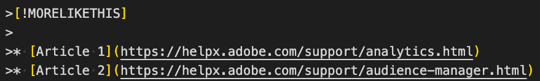

# Guide du style de syntaxe Markdown

Cette page illustre le composant Markdown pour la création de documentation technique d’expérience numérique à l’aide du format markdown (.md). Cette page contient des informations détaillées sur les employés d’Adobe.

EDS

Voir ici : [Adobe.com](https://www.adobe.com){rel=noFollow}

<!--
* You can [view a basic sample file](sample.md) or [view a sample file with advanced syntax examples](sample-full.md)
-->

>[!TIP]
>
>Regardez cette [vidéo AdobeDocs Markdown](https://video.tv.adobe.com/v/26165).

Pour la plupart, nous suivons la syntaxe GFM (Git-Flavored Markdown) standard pour le formatage de texte. Toutefois, certaines syntaxes (telles que les lignes horizontales) ne sont pas prises en charge et nous avons étendu Markdown de plusieurs façons pour répondre à nos besoins en documentation.

## Mise en forme de texte de base

Un paragraphe ne nécessite pas de syntaxe spéciale dans Markdown. Ajoutez une ligne vide entre chaque paragraphe.

Pour mettre le texte en forme en **gras**, entourez-le de deux astérisques :

```
This text is **bold**.
```

Pour mettre le texte en *italique*, entourez-le d’astérisques uniques :

```
This text is *italic*.
```

Pour mettre le texte en forme ***gras et italique***, entourez-le de trois astérisques :

```
This is text is both ***bold and italic***.
```

Pour ignorer les caractères de formatage Markdown, utilisez `\` avant le caractère :

`This is not \*italicized\* type.`

Rendu : il ne s’agit pas d’un type \*italisé\*.

## Badges

En cours. En attente de Loc.

<!--

See the [dev version of this article](https://experienceleague-dev.corp.adobe.com/docs/authoring-guide-exl/using/markdown/syntax-style-guide.html#badges) for an example. Or [this one](https://experienceleague-dev.corp.adobe.com/docs/internal-test/test/badge.html).

There are two ways to create badges:

* **Metadata badge** - Specify the badge information in metadata so that the badge appears above the title in the article. This is especially useful for adding a badge to all articles in a guide or repo via the TOC.md or metadata.me files.
* **Inline badge** - Specify the badge information on its own line or in a heading, table, or other page element.


**Badge syntax**

*Metadata*: `badge: "Beta Content" type="Informative" url="https://www.example.com" tooltip="Go to example.com"`

*Inline*: `[!BADGE Beta Content]{type=Informative url="https://www.example.com" tooltip="Go to example.com"}`

**Examples**

```
|Type|Badge|
|---|---|
|Informative (default)|[!BADGE Beta]{type=Informative url="https://www.example.com"}|
|Positive|[!BADGE New Feature]{type=Positive url="https://www.example.com" tooltip="Go to example.com"}|
|Negative|[!BADGE Discontinued]{type=negative tooltip="This feature is now end of life"}|
|Neutral|[!BADGE Maybe]{type=Neutral tooltip="A rider fell off his horse..."}|
|Caution|[!BADGE Attention]{type=Caution tooltip="Yellow status"}|
```

**Rendered**

|Type|Badge|
|---|---|
|Informative (default)|[!BADGE Beta]{type=Informative url="https://www.example.com"}|
|Positive|[!BADGE New Feature]{type=Positive url="https://www.example.com" tooltip="Go to example.com"}|
|Negative|[!BADGE Discontinued]{type=negative tooltip="This feature is now end of life"}|
|Neutral|[!BADGE Maybe]{type=Neutral tooltip="A rider fell off his horse..."}|
|Caution|[!BADGE Attention]{type=Caution tooltip="Yellow status"}|

**More details**

* Only the badge label is required. The `type`, `url`, and `tooltip` parameters are optional. The `type` parameter determines the color. The `url` parameter lets users click the badge to open an article. The `tooltip` parameter displays the tooltip text on mouseover.
* If you want multiple badges to appear at the top of the page, use different badge names. For example, you can create badge names such as `badgeBeta` or `badgeWeb`. Example:

  ```
  badge1: "Beta"
  badge2: "Campaign Web"
  ```

* For metadata badges, make sure that all values are wrapped in quotes. For inline badges, make sure that `url` and `tooltip` are wrapped in quotes.
* Valid type values include *Informative* (default, blue), *Positive* (green), *Negative* (red), *Neutral* (dark gray), and *Caution* (yellow). 

-->

## Blockcits

Notre système de création utilise la syntaxe de guillemets de bloc (`>` au début des lignes) pour identifier les extensions de marqueurs personnalisées pour les conseils, les notes et les vidéos. Vous pouvez créer de véritables guillemets de bloc en ajoutant un caractère `>` devant un paragraphe.

>Ceci est une citation cochée.

```
>This is a blockquote quotation.
```

## Bloc de code (en ligne){#code-block}

**Quand utiliser**

Utilisé pour effectuer le rendu d’un élément de code en ligne dans une phrase. Idéal pour appeler un nom de cookie, un nom de fichier, une valeur ou une commande qui ne nécessite pas de bloc de code entièrement clôturé.

Contenu dans les blocs de code dans rendu en l’état et non localisé. (La seule exception à cette règle est la syntaxe `!UICONTROL` et `!DNL`, qui est supprimée lors du conditionnement en vue de la publication.)

Utilisez également des blocs de code pour des exemples d’URL qui ne doivent pas être validés : `https://www.example.com`

**Syntaxe**

Un bloc de code utilise des apostrophes uniques pour encadrer l’élément de code que vous souhaitez mettre en surbrillance.

```
This is `inline code` within a paragraph of text.
```

**Exemple**

This is `inline code` within a paragraph of text.

>[!TIP]
>
>Vous pouvez également placer du texte dans des apostrophes à triple dos (&grave;&grave;&grave;) pour créer un bloc de code intégré. Cela s’avère particulièrement utile lorsque vous devez référencer un caractère de coche arrière dans un bloc de code intégré. Exemple :
>
&grave;&grave;&grave;`Use a back tick (`&grave;`) for formatting`&grave;&grave;&grave;&grave;&grave;

## Bloc de code (clôturé)

**Quand utiliser**

Utilisez un bloc de code pour afficher la syntaxe du code. Un bloc de code clôturé utilise trois apostrophes ouvrantes pour encadrer l’élément de code que vous souhaitez mettre en surbrillance. Ajoutez des lignes vierges au-dessus et au-dessous du bloc de code clôturé.

Notez que les blocs de code ne sont pas localisés.

>[!TIP]
>
Spécifiez une langue lorsque vous créez un bloc de code clôturé. La spécification d’une langue permet de mettre en surbrillance la syntaxe propre à cette langue et affiche un bouton **Copier** pour les utilisateurs. Vous pouvez également afficher les numéros de ligne si vous indiquez une langue.

**Syntaxe**

Utilisez trois apostrophes ouvrantes ( &grave;&grave;&grave; ) avant et après les lignes de code. Assurez-vous que les apostrophes ouvrante et fermante sont mises en retrait au même nombre d’espaces. Pour un rendu optimal, spécifiez un langage de code.

&grave;&grave;&grave;{0`javascript`

**Exemple**

```javascript
var visitor = Visitor.getInstance("INSERT-MARKETING-CLOUD-ORGANIZATION ID-HERE", {
     trackingServer: "INSERT-TRACKING-SERVER-HERE", // same as s.trackingServer
     trackingServerSecure: "INSERT-SECURE-TRACKING-SERVER-HERE", // same as s.trackingServerSecure

     // To enable CNAME support, add the following configuration variables
     // If you are not using CNAME, DO NOT include these variables
     marketingCloudServer: "INSERT-TRACKING-SERVER-HERE",
     marketingCloudServerSecure: "INSERT-SECURE-TRACKING-SERVER-HERE" // same as s.trackingServerSecure
});
```

### Mise en surbrillance de syntaxe pour les blocs de code

Experience League prend en charge la mise en surbrillance de la syntaxe pour les blocs de code. Veillez à spécifier un langage tel que `java` après avoir placé un ensemble d’accents graves pour vous assurer que la syntaxe est correctement mise en surbrillance. Pour obtenir la liste des langages valides, consultez [https://prismjs.com](https://prismjs.com/#supported-languages). Si vous ne trouvez pas certains langages, veuillez soumettre un ticket jira.

### Numérotation des lignes dans les blocs de code

Ajoutez `{line-numbers="true"}` après le langage pour activer la numérotation des lignes.

Exemple avec numéros de ligne (&grave;&grave;&grave;`html {line-numbers="true"}`) :

```html {line-numbers="true"}
<!DOCTYPE html>
<html>
<body>

<h1>My First Heading</h1>
<p>My first paragraph.</p>

</body>
</html>
```

**Commencer la numérotation sur la ligne _**

Ajoutez `start-number="n"` après la syntaxe du numéro de ligne pour commencer la numérotation sur un numéro autre que 1.

Exemple avec une nouvelle ligne de départ (&grave;&grave;&grave;`html {line-numbers="true" start-line="7"}`) :

```html {line-numbers="true" start-line="7"}
<!DOCTYPE html>
<html>
<body>

<h1>My First Heading</h1>
<p>My first paragraph.</p>
<p>My second paragraph.</p>

</body>
</html>
```

### Mise en surbrillance des lignes dans les blocs de code

Ajoutez `highlight="n"` après la syntaxe du numéro de ligne pour mettre en surbrillance les lignes dans un bloc de code. Spécifier `11-13, 16` mettra en évidence les lignes 11 à 13 et 16.

Exemple avec mise en surbrillance de ligne (&grave;&grave;&grave;`html {line-numbers="true" start-line="7" highlight="11-13, 16"}`) :

```html {line-numbers="true" start-line="7" highlight="11-13, 16"}
<!DOCTYPE html>
<html>
<body>

<h1>My First Heading</h1>
<p>My first paragraph.</p>
<p>My second paragraph.</p>

</body>
</html>
```

### Formatage des variables dans les blocs de code

La syntaxe de variable telle que `<i>italic</i>` n’est pas prise en charge dans les blocs de code. Pour indiquer du texte de variable, une option consiste à utiliser des chevrons `< >`.

## Sections réductibles

Vous pouvez créer une section réductible (parfois appelée **accordéon**) qui est masquée par défaut. L’utilisateur peut cliquer sur le titre pour développer ou réduire la section.

Il est possible d’utiliser du texte réductible pour simplifier du contenu complexe, par exemple en rationalisant une page de questions fréquentes ou en désencombrant une procédure complexe avec des listes imbriquées. Par exemple, au lieu d’afficher un ensemble de sous-étapes, vous pouvez réduire ces dernières dans une section &quot;Afficher les détails&quot;.

**Syntaxe**

```
+++See details
This is text inside a collapsible section.

* Bullet one
* Bullet two
* Bullet three

+++
```

**Exemple**

+++Voir les détails
Il s’agit de texte à l’intérieur d’une section réductible.

* Puce 1
* Puce 2
* Puce 3

+++

**Notes**

* N’imbriquez pas de sections réductibles dans des sections réductibles. Les sections réductibles imbriquées ne s’affichent pas correctement. Toutefois, elles n’entraînent pas l’échec de la validation. Par conséquent, les utilisateurs verront la syntaxe `+++` de la section imbriquée.
* Veillez à ajouter des lignes vierges au-dessus et en dessous des éléments tels que les listes à puces et les blocs de code dans la section réductible, ou vous obtiendrez une erreur de validation.
* Vous pouvez ajouter des en-têtes dans des sections réductibles, mais cela n’est pas recommandé.
* [Les accordéons ne sont pas toujours la réponse pour le contenu complexe sur les ordinateurs de bureau](https://www.nngroup.com/articles/accordions-complex-content/)
* L’un des inconvénients historiques des sections réductibles est que **Rechercher sur la page** (Ctrl/Cmd+F) ignore le texte réduit. Bien que cela soit toujours vrai dans Safari, ce n’est plus le cas dans Chrome ; Find in Page détecte le texte réduit dans Chrome.
* Exemple de page [mises à jour de maintenance](https://experienceleague.adobe.com/docs/workfront-known-issues/releases/current-updates.html?lang=en) utilisant des sections réductibles.

## Commentaires et remarques

Les commentaires n’apparaissent pas dans le système d’aide rendu. Utilisez les commentaires pour laisser des notes pour vous-même ou pour d’autres auteurs. Vous pouvez également utiliser des commentaires pour les brouillons de sections de texte.

Pour les commentaires, gardez à l’esprit que s’ils ne sont pas rendus dans le système d’aide, ils sont visibles par les utilisateurs qui modifient les fichiers Markdown sur GitHub.com. Ne pas inclure d’informations confidentielles dans les commentaires.

```
<!-- standard comment code -->

DO NOT USE the following:
<!--> bad comment syntax <-->
```

Vous ne devriez pas pouvoir voir le texte en-dessous de cette page (&quot;Vous ne pouvez pas me voir&quot;), sauf si vous modifiez le document.

<!--
You can't see me (unless you're editing in Git).
-->

**Rappel :** Les commentaires (remarques) n’apparaissent pas dans les articles d’aide destinés au public. Toutefois, les commentaires apparaissent dans les fichiers Markdown destinés au public que les utilisateurs peuvent consulter et modifier.

>[!IMPORTANT]
>
Évitez d’ajouter des commentaires dans les composants de bloc, tels que les listes à puces, en particulier les listes à puces imbriquées. Le commentaire peut modifier le rendu de la liste à puces.
>
Dans le fichier TOC.md , ne mettez pas en commentaire les lignes situées au milieu de la liste de la table des matières. Il se peut que la liste de la table des matières soit divisée et que des erreurs de validation se produisent. Déplacez plutôt les commentaires dans la table des matières à la fin du fichier.

## CONTEXTUALHELP

Les auteurs peuvent collaborer avec les équipes de produits pour ajouter des fenêtres contextuelles d’aide dans l’interface utilisateur du produit Experience Cloud ou Experience Platform. Exemple :

```markdown
>[!CONTEXTUALHELP]
>id="platform_destinations_activate_mandatorykey_4"
>title="About mandatory attributes"
>abstract="Select the XDM schema attributes that all exported profiles should include. Profiles without the mandatory key are not exported to the destination. Not selecting a mandatory key exports all qualified profiles regardless of their attributes."
>additional-url="http://www.adobe.com/go/destinations-mandatory-attributes-en" text="Learn more in documentation"
```

## Listes de définitions

Pour les listes de définitions, nous ne prenons pas encore en charge la syntaxe Markdown standard. Utilisez plutôt une mise en forme manuelle telle que :

```
**Frog** - An amphibious green creature. Likes flies.
```

Rendu :

**Grenouille** - Une créature verte amphibie. J&#39;aime les mouches.

<!--
A definition list is a Markdown extension that supports the Definition List component in AEM. A definition list consists of a term and its definition.

**When to use**

Using a definition list is optional. To define lists of features or options, you can use either the definition list syntax or use basic Markdown formatting, such as applying bold to option names.

**Syntax**

```
Frog
: An amphibious green creature. Likes flies.

Cat
: A less amphibious creature than frogs.
```

**Example**

Frog
: An amphibious green creature. Likes flies.

Cat
: A less amphibious creature than frogs.
-->

## Fichiers de téléchargement

Téléchargez le fichier .zip ou tout autre fichier téléchargeable dans le répertoire des ressources, puis liez-le. S’il s’agit d’un fichier .zip, cliquez sur le lien pour télécharger le fichier. S’il s’agit d’un type de fichier tel que PDF ou PNG pouvant être ouvert dans un navigateur, un clic sur le lien ouvre un nouvel onglet. Pour ces fichiers, pensez à les compresser ou à fournir des instructions pour cliquer avec le bouton droit sur le lien et le télécharger.

`Download` &amp;lbrack;`download-test.zip`&amp;track;`(assets/download-test.zip)`

Rendu :

Télécharger [download-test.zip](assets/download-test.zip)

>[!NOTE]
>
La taille de fichier maximale pour les fichiers de téléchargement et les images est de 100 Mo. C&#39;est la limite github.com. La limite git.corp.adobe.com est supérieure (250 Mo), mais nous devons pouvoir copier les fichiers dans le miroir github.com.

## Titres {#headings}

Dans Markdown, vous utilisez des signes dièse (`#`) pour identifier les niveaux d’en-tête. Le premier niveau (`#`) est le titre de l’article, qui est également spécifié dans l’en-tête des métadonnées. Conservez-les de la même manière. Le second niveau (`##`) représente les en-têtes principaux de la page qui seront inclus dans la mini-table des matières. Si vous êtes habitué à écrire dans AEM (chl-author), les en-têtes de niveau 2 (`##`) sont mappés au composant &quot;En-tête 1&quot; dans AEM.

Nombre maximal de caractères pour les en-têtes : 69 caractères (anglais) / 120 caractères (LOC).

```
# This is level 1 (article title)

## This is level 2
   
### This is level 3
```

**Bonnes pratiques en matière d’en-tête**

* Assurez-vous qu’un en-tête de niveau 1 (`#`) suit une ligne vide après les métadonnées de chaque article.
* N’ignorez pas les niveaux, tels que le passage du niveau 2 (`##`) au niveau 4 (`####`).
* Incluez une ligne vide *avant* et *après* chaque en-tête.
* Si un en-tête comprend des chiffres, spécifiez un ID d’en-tête explicite qui ne commence pas par un nombre, tel que `## Release notes for 2016 {#release-notes-2016}`.
* Nous vous recommandons seulement 3 niveaux d’en-tête. Les niveaux 4 et ultérieurs ne sont pas correctement rendus à l’heure actuelle.
* Les en-têtes s’affichent dans le volet de navigation de droite, de sorte que les utilisateurs puissent cliquer pour accéder à une section. Par défaut, deux niveaux d’en-têtes s’affichent dans le volet de navigation de droite. Si vous souhaitez modifier le nombre de niveaux, utilisez des métadonnées `mini-toc-levels`, telles que `mini-toc-levels: 3`.

**ID d’en-tête**

Les identifiants d’en-tête (également appelés *identifiants d’ancrage*) sont utilisés pour créer des liens profonds personnalisés vers des sections dans les articles. Pour spécifier un ID d’en-tête, utilisez le format suivant :

```
## Creating processing rules {#processing-rules}
```

Les ID d’en-tête doivent être en minuscules et suivis d’une césure.

Si vous ne spécifiez pas d’ID d’en-tête pour un en-tête, l’ID d’en-tête par défaut est l’en-tête &quot;simplifié&quot; (en minuscules et avec césure). Par exemple, l’en-tête `## Creating widgets and Such` aura une ancre `#creating-widgets-and-such`.

## Syntaxe des HTMLS {#html}

Pour diverses raisons, y compris la sécurité et l’accessibilité, nous limitons la syntaxe de l’HTML qui peut être utilisée dans Markdown. La liste suivante présente la syntaxe d’HTML prise en charge. Toute syntaxe d’HTML qui ne figure pas dans cette liste entraînera une erreur de validation.

```html
<table>
<tbody>
<td>
<tfoot>
<thead>
<th>
<tr>
<col>
<colgroup>
<p> (paragraph break)
<ul> (unordered list / numbered list)
<ol> (ordered list / bullet list)
<li> (list item)
<br> (line break)
<b>
<caption>
<i>
<strong> (bold)
<u> (underline)
<s> (strikethrough)
<span>
<sub> (subscript)
<sup> (superscript)
<a>

<div>
<em> (emphasis, italics)
<pre> (codeblock)
<code>
<codeblock>
```

<!--
Bob: Check above no space char. (ignore the space; I can't add a codeblock inside this codeblock)
-->

Si vous souhaitez que la syntaxe des HTMLS soit ajoutée à cette liste, enregistrez un ticket ou contactez l&#39;équipe SSE.

## Images {#images}

Utilisez la syntaxe `` pour les images. Les crochets `[ ]` incluent du texte de remplacement et les parenthèses `( )` incluent l’emplacement de l’image et le texte de survol facultatif (info-bulle). Le point d’exclamation permet de distinguer une image d’un lien.

```

```


Pour les images partagées, vous pouvez placer les images dans un dossier de ressources racine, puis utiliser un lien racine qui fonctionne à partir de n’importe quel fichier dans un référentiel :

```
/help/assets/imagename.png
```

### Redimensionnement et alignement des images

**Propriétés de l’image (avec image alignée à droite)** {align="right"}

Utilisez la syntaxe suivante pour modifier la largeur ou le centre de l’image par défaut ou aligner l’image à droite dans la vue de page ou la cellule du tableau.

```
{width="300" align="center"}
```

Rendu :

{width="300" align="center"}

* Pour les images de grande taille, nous vous recommandons de créer des images suffisamment grandes pour être mises à l’échelle de manière à s’adapter à la largeur de la page (au moins 640 pixels de large). La largeur recommandée est de 1 500 pixels. Il n’est pas nécessaire de créer des images de plus de 2 500 pixels ou 500 kilo-octets. La taille de fichier maximale des images est de 100 Mo.
* Pour les petites images, créez des images en utilisant la largeur souhaitée en pixels ou utilisez le paramètre de largeur, tel que `{width="250"}` (pixels) ou `{width="50%"}` (pourcentage de la zone de vue, et non la taille de l’image d’origine). Les images sont mises à l’échelle proportionnellement. Notez que les images peuvent être mises à l’échelle vers le haut ou vers le bas. Soyez donc prudent quant à la pixellisation.
* Dans certains cas, les images de la même interface apparaissent disproportionnées sur la page, car les images plus larges (comme une barre d’outils) sont réduites tandis que les images plus étroites (comme un panneau) ne le sont pas. Dans ce cas, envisagez de réduire les images plus larges afin d’améliorer la cohérence visuelle.
* Vous pouvez modifier l’alignement d’une image dans la zone d’affichage. Utilisez `{align="center"}` ou `{align="right"}`. Le paramètre `valign` n’est pas pris en charge.

>[!NOTE]
>
La taille de fichier maximale des images est de 100 Mo. C&#39;est la limite github.com. La limite git.corp.adobe.com est supérieure (250 Mo), mais nous devons pouvoir copier les fichiers dans le miroir github.com.

### Liens d’image

Si vous souhaitez permettre aux utilisateurs de cliquer sur une image pour accéder à une autre page, utilisez ce format.

**Syntaxe**

```
[](https://www.adobe.com)
```

**Exemple**

Cliquez sur cette image pour accéder au site web de l’Adobe.

[](https://www.adobe.com)

<!--
### Click-to-zoom images

Use the `zoomable` parameter to allow users to click an image to view an enlarged version of the image. When the user mouses over a zoomable image, the pointer becomes a magnifying glass. When clicked, the image expands to the full width of the browser. It can be dismissed with a close button.

**Example**

{width="100" zoomable="yes"}

**Syntax**

```
{width="100" zoomable="yes"}
```

-->

## Liens et références croisées {#links-and-cross-references}

Les liens externes sont directs et peuvent être rendus sous la forme d’une légende liée ou d’une URL pure.

```
[Adobe](https://www.adobe.com)
```

Rendu :

[Adobe](https://www.adobe.com)

Si vous ajoutez une URL directement au texte, elle n’est pas automatiquement convertie en lien. Si vous souhaitez qu’une URL apparaisse comme lien, ajoutez la syntaxe `< >`. Exemples :

```
https://www.adobe.com

<https://www.adobe.com>
```

Rendu :

https://www.adobe.com

<https://www.adobe.com>

Les liens vers des articles (références croisées) peuvent être un peu plus complexes.

**Option 1 : lien relatif standard**

Voici à quoi ressemble un lien relatif standard :

```
See [Overview example article](collaborative-doc-instructions/overview.md)
```

Le chemin d’accès doit prendre en compte l’emplacement du fichier source et du fichier cible. Vous pouvez utiliser tous les opérandes de lien relatifs, tels que `./` (répertoire actuel), `../` (répertoire précédent) et `../../` (deux répertoires secondaires).

**Option 2 : lien relatif racine**

L’avantage de ce type de lien est qu’il ne doit prendre en compte que le fichier cible. Il fonctionne à partir de n’importe quel fichier source dans le référentiel, quel que soit l’emplacement du fichier source.

```
/help/using/docile-rules/introduction.md
```

**Lien profond**

Pour créer un lien vers un en-tête d’un article, l’en-tête cible doit avoir un ID d’en-tête explicite (également appelé &quot;ID d’ancrage&quot;). Exemple :

`## Creating audience segments {#creating-audience-segments}`

Pour créer un lien vers cet en-tête dans la même page, utilisez l’ID d’en-tête comme lien :

`See [Creating audience segments](#creating-audience-segments)`

Pour créer un lien vers cet en-tête à partir d’un autre article du référentiel, ajoutez le suffixe ID d’en-tête à la fin du lien :

`See [Audiences: Creating audience segments](audiences.md#creating-audience-segments)`

**Ouvrir dans un nouvel onglet**

Si vous souhaitez qu’un lien ouvre un nouvel onglet, par exemple lorsque vous passez à un autre guide, utilisez la propriété `{target="_blank"}` dans le lien.

Exemple :

`[See What's new](whats-new.md){target="_blank"}`

## Métadonnées

Ajoutez des métadonnées dans la partie supérieure du fichier Markdown. La ligne suivante située après la ligne de métadonnées (et la ligne vierge) DOIT correspondre au titre de l’article (# Titre).

```
---
title: Title for search optimization
description: This is the article description used for search optimization. Use common search keywords and synonyms.
---

# Article title
```

## Balises de localisation : UICONTROL, DNL et DONOTLOCALIZE

Tout notre contenu dʼaide Markdown est initialement localisé à lʼaide de la traduction automatique. Si lʼaide nʼa jamais été localisée, nous conservons la traduction automatique. Cependant, si le contenu dʼaide a été localisé dans le passé, le contenu traduit par lʼordinateur agit comme espace réservé pendant que le contenu est en cours de traduction humaine.

## More Like This

Utilisez le composant &quot;Plus comme ceci&quot; pour afficher les liens connexes à la fin d’un article. Lorsqu’il est rendu, le composant MORELIKETHIS est rendu sous la forme &quot;Articles associés&quot; (et localisé dans d’autres langues).

**Syntaxe**



**Exemple**

>[!MORELIKETHIS]
>
* [Article 1](https://helpx.adobe.com/fr/support/analytics.html)
* [Article 2](https://helpx.adobe.com/fr/support/audience-manager.html)

## Remarques / recommandations

Nous avons étendu Markdown afin de mettre en forme différents types de notes : Remarque, Conseil, Important et Avertissement.

**Syntaxe**

```
>[!NOTE]
>
>This is a standard NOTE block.
```

**Exemple**

>[!NOTE]
>
Il s’agit d’un bloc NOTE standard.

**Syntaxe**

```
>[!TIP]
>
>This is a standard tip.
```

**Exemple**

>[!TIP]
>
Il s’agit d’un conseil standard.

**Syntaxe**

```
>[!WARNING]
>
>This is a standard warning block.
```

**Exemple**

>[!WARNING]
>
Il s’agit d’un bloc d’avertissement standard.

**Syntaxe**

```
>[!IMPORTANT]
>
>This is a standard important block.
```

**Exemple**

>[!IMPORTANT]
>
C&#39;est un bloc important standard.

**Syntaxe**

```
>[!NOTE]
>
>This is a standard NOTE block.
>
>It includes multiple paragraphs.
```

**Exemple**

>[!NOTE]
>
Il s’agit d’un bloc NOTE standard.
>
Il comprend plusieurs paragraphes.

Nouveaux types de notes pris en charge :

>[!ADMIN]
>
Ceci est une note de l’administrateur. EXL uniquement.

>[!AVAILABILITY]
>
Il s’agit d’une note de disponibilité. EXL uniquement.

>[!PREREQUISITES]
>
Il s’agit d’une note de conditions préalables. EXL uniquement.

>[!INFO]
>
Il s’agit d’une note d’information. EXL uniquement.

>[!ERROR]
>
Il s’agit d’une note d’erreur. EXL uniquement.

>[!SUCCESS]
>
Il s’agit d’une note de succès. EXL uniquement.

## Listes numérotées et listes à puces {#lists}

Pour créer des listes numérotées, commencez une ligne par `1.` ou `1)`, mais choisissez une méthode et utilisez-la de manière cohérente dans l’article. Il n’est pas nécessaire de spécifier les nombres. GitHub le fait pour vous.

Utilisez le nombre `1` pour chaque étape de la liste numérotée.

Ajoutez des lignes vides avant et après les listes.

**Syntaxe**

```
1. This is step 1.

1. This is the next step.

   1. This is a sub-step

   1. This is a sub-step

1. This is yet another step, the third.
```

**Exemple**

1. This is step 1.

   1. Sous-étape

   1. Sous-étape

1. This is the next step.

1. This is yet another step, the third.

Pour créer des listes à puces, commencez une ligne par `*` ou `-` ou `+`, mais choisissez une méthode et utilisez-la de manière cohérente dans l’article. (Si vous mélangez les formats, par exemple `*` et `+`, vous obtiendrez une erreur de validation Markdown lorsque vous archiverez le fichier.)

**Bonne pratique :** Utilisez `*` pour les puces. Visual Studio Code applique l’astérisque pour les puces. Il est donc plus facile de rester avec les astérisques pour automatiser la création d’une liste non ordonnée. (Vous avez peut-être remarqué que le fichier TOC.md utilise plus signes `+` pour les listes. C&#39;est un frein à la migration. Tout caractère de puce valide fonctionnerait tant qu’il est cohérent dans l’article.)

**Syntaxe**

```
* First item in an unordered list.
* Another item.
* Here we go again.
```

**Exemple**

* First item in an unordered list.
* Another item.
* Here we go again.

Vous pouvez également incorporer des listes dans des listes et ajouter du contenu entre des éléments de liste. Retrait du contenu entre les éléments de la liste pour éviter de commencer une nouvelle liste. Les éléments entre les étapes doivent être mis en retrait au début du texte : 3 espaces pour les listes numérotées, 2 espaces pour les listes à puces.

```
1. Set up your table and code blocks.
1. Perform this step.

   
   
1. Make sure that your table looks like this: 

   | Hello | World |
   |---|---|
   | How | are you? |
   
1. This is the fourth step.

   >[!NOTE]
   >
   >This is note text.
   
1. Do another step.

   This is an indented line.
```

**Exemple**

1. Set up your table and code blocks.
1. Perform this step.

   

1. Make sure that your table looks like this:

   | Hello | World |
   |---|---|
   | How | are you? |

1. This is the fourth step.

   >[!NOTE]
   >
   This is note text.

1. Do another step.

   C&#39;est une ligne mise en retrait.

REMARQUE : si vous effectuez un retrait trop important (6 espaces au lieu de 3, par exemple), le contenu de cette ligne est traité comme un bloc de code.

## Zones d’ombre

Les zones de nuances sont utiles pour déclencher une section de contenu à partir du reste de la page. Par exemple, l’équipe Workfront aime ajouter des zones &quot;Exemple&quot; contenant du texte, des images et des exemples de code pour atteindre un objectif spécifique. Une zone d’ombrage peut également s’avérer utile pour les sections &quot;En vous-même&quot; ou &quot;Cas d’utilisation&quot;, ou pour les notes ou conseils étendus.

Pour créer une zone d’ombre, ajoutez `>[!BEGINSHADEBOX]` au début de la section et `>[!ENDSHADEBOX]` à la fin. Tout le contenu entre ces balises de début et de fin aura un arrière-plan gris. L’ajout d’un libellé à `BEGINSHADEBOX` (par exemple `>[!BEGINSHADEBOX "Use Case]`) est une méthode facultative pour créer un titre de zone d’ombrage en gras. Vous pouvez également ajouter du texte en gras ou un en-tête à la ligne suivante.

Exemple :

>[!BEGINSHADEBOX]

**Suppression de la bordure dans une table d&#39;HTML**

Dans certains cas, vous utilisez un tableau d’HTML pour créer une conception équilibrée, mais vous ne souhaitez pas que le contenu ressemble à un tableau. Pour désactiver une bordure pour un tableau d’HTML d’une ligne, utilisez la syntaxe suivante :

```
<table>
<tr style="border: 0;">
```

>[!NOTE]
>
Ne fais pas trop usage. Pour les tableaux normaux, nous voulons conserver une conception cohérente sur l’ensemble du contenu.


Dans un tableau à trois colonnes, vous pouvez également ajouter `<td align="center">` et `<td align="right">` pour répartir le contenu des cellules uniformément dans la zone d’affichage. Si ce n&#39;était pas le cas, je vous l&#39;aurais dit.

C&#39;est la dernière ligne de la boite à nuages.

>[!ENDSHADEBOX]

## Extraits et inclusions

Pour partager du texte entre des articles dans un référentiel, vous créez un dossier `_includes` dans le dossier `help`. Ce dossier `_includes` peut comporter des fichiers .md qui peuvent être référencés (inclus) à partir d’autres fichiers du référentiel. En outre, un fichier `snippets.md` de ce référentiel peut inclure des ancres Head2 qui peuvent être référencées à partir de n’importe quel fichier du référentiel.

Référence à H2 dans le fichier snippets.md : `{{id-name}}`

Référence à inclure le fichier : `{{$include /help/_includes/filename.md}}`

## Tableaux

Les tables peuvent poser problème dans Markdown. Lorsque des tableaux sont migrés à partir du système de création précédent, les tableaux simples (une ligne par cellule) sont formatés en tant que tableaux Markdown natifs (recommandé). Les tableaux plus avancés sont formatés en tant qu’HTML.

>[!TIP]
>
Regardez la vidéo [Markdown Tables](https://video.tv.adobe.com/v/26220)

Les tableaux natifs s’affichent souvent mieux dans Markdown. La taille des colonnes est fonction de leur contenu. Les tableaux d’HTML sont rendus avec des colonnes de largeur égale.

Par défaut, Markdown ne prend pas en charge plusieurs lignes ou listes dans les cellules. Cependant, nous avons étendu les tableaux Markdown afin d’autoriser plusieurs lignes dans les cellules (en utilisant `<p>` ou `<br>`) ou les listes de base (en utilisant `<ul><li>`, etc.).

>[!IMPORTANT]
>
Soyez prudent lors de l’ajout de ces codes d’HTML aux tableaux Markdown. Si votre syntaxe est incorrecte, vous obtiendrez une erreur de validation confuse qui ne décrit pas exactement le problème. Vérifiez la syntaxe de votre HTML pour vous assurer qu&#39;il est bien formé.

Non autorisé dans les tableaux : iframes, étendues de cellules, tableaux incorporés.

Non autorisé dans le tableau Markdown natif : listes imbriquées ou complexes.

Voir [Tables](tables.md)

**Syntaxe**

```
| Header | Another header | Yet another header |
|--- |--- |--- |
| row 1 | row 1 column 2 | row 1 column 3 |
| row 2 | row 2 column 2 | row 2 column 3 |
```

**Exemple**

| Header | Another header | Yet another header |
|--- |--- |--- |
| row 1 | row 1 column 2 | row 1 column 3 |
| row 2 | row 2 column 2 | row 2 column 3 |

Les tableaux simples fonctionnent correctement dans Markdown. Toutefois, les tableaux contenant plusieurs paragraphes ou listes dans une cellule sont difficiles à utiliser. Pour ce type de contenu, nous recommandons d’utiliser un autre format, comme des titres et du texte.

**Table Markdown avec sauts de paragraphe et listes**

```
| Header | Another header | Yet another header |
|------------|----------|----------------|
| row 1 | first paragraph in cell<p>second paragraph in cell(`<p>`)<br>line break (`br`) | row 1 column 3 |
| row 2 | bullet list<ul><li>item 1</li><li>item 2</li><li>item 3</li></ul> | row 2 column 3 |
```

**Exemple**

| Header | Another header | Yet another header |
|------------|----------|----------------|
| row 1 | premier paragraphe dans la cellule<p>deuxième paragraphe dans la cellule(`<p>`)<br>saut de ligne (`br`) | row 1 column 3 |
| row 2 | liste à puces<ul><li>item 1</li><li>item 2</li><li>élément 3</li></ul> | row 2 column 3 |

**Table Markdown avec sauts de ligne et liste falsifiée**

Solution avec des balles manuelles.

```
| Color | Things to Do |
|--- |--- |
| Red | * Read <br> * Write <br> * Study |
| Blue | * Swim <br> * Run <br> * Lift <br> **Note**: Remember to train smart.|
```

**Exemple**

| Couleur | Choses à faire |
|--- |--- |
| Rouge | * Lecture <br> * Écriture <br> * Étude |
| bleu | * Nager <br> * Exécuter <br> * Effet élévateur <br> **Remarque** : N’oubliez pas d’entraîner smart. |


## Onglets    

Un onglet est une zone cliquable en haut d’une section qui affiche un contenu différent. Lorsqu’un utilisateur clique sur un onglet, son contenu s’affiche et le contenu des autres onglets est masqué.

Pour créer un jeu d’onglets, ajoutez `>[!BEGINTABS]` au début du jeu d’onglets et `>[!ENDTABS]` après le dernier onglet. Ajoutez `>[!TAB <tab title>]` balises pour chaque section d’onglet et ajoutez le contenu de chaque onglet sous celui-ci.

**Syntaxe des onglets**

```
>[!BEGINTABS]

>[!TAB iOS]

This content appears in the iOS tab.

>[!TAB Android]

This content appears in the Android tab.

>[!TAB Windows]

This content appears in the Windows tab.

>[!TAB MacOS]

This content appears in the MacOS tab.

>[!TAB Linux]

This content appears in the Linux tab.

>[!ENDTABS]
```

**Rendered**

>[!BEGINTABS]

>[!TAB iOS]

Ce contenu apparaît dans l’onglet iOS .

>[!TAB Android]

Ce contenu apparaît dans l’onglet Android .

>[!TAB Windows]

Ce contenu apparaît dans l’onglet Windows.

>[!TAB MacOS]

Ce contenu apparaît dans l’onglet MacOS .

>[!TAB Linux]

Ce contenu apparaît dans l’onglet Linux .

>[!ENDTABS]

**Notes d’onglet**

* Les utilisateurs ne peuvent pas utiliser la recherche sur les pages (Ctrl+F/Cmd+F) pour localiser le contenu dans les onglets qui ne sont pas affichés.
* Si les titres des onglets s’étendent au-delà de la largeur de la page vue dans le navigateur de l’utilisateur, une barre de défilement horizontale s’affiche.
* Vous ne pouvez pas mettre en forme les titres des onglets. Toute syntaxe que vous ajoutez sera transmise dans le titre. Par exemple, `>[!TAB **iOS**]` s’affichera sous la forme `**iOS**`.
* Vous pouvez créer plusieurs jeux de tabulations sur une page, mais vous ne pouvez pas les imbriquer dans un autre jeu.
* Un arrière-plan ombré est appliqué au jeu d’onglets afin que les utilisateurs puissent voir distinguer le contenu de l’onglet de tout autre contenu.

## Surbrillance du texte

L’équipe Workfront a demandé à pouvoir utiliser la mise en surbrillance jaune pour indiquer l’aperçu des fonctionnalités à venir. Voilà comment cela fonctionne.

Exemple :

```
This entire paragraph should NOT be highlighted. <span class="preview"> This word is **bold** inside a highlighted sentence.</span> And this is just the last sentence.
```

Rendu :

Ce paragraphe entier ne doit PAS être mis en surbrillance. <span class="preview">Ce mot est en **gras** dans une phrase surlignée.</span>Et ceci n’est que la dernière phrase.

En règle générale, utilisez `<span class="preview">` pour mettre en surbrillance un paragraphe ou du texte dans un paragraphe, et `<div class="preview">` pour plusieurs paragraphes et composants.

>[!NOTE]
>
Nous travaillons toujours à améliorer l’affichage de surbrillance de certains éléments de page tels que les notes et les tableaux. N’hésitez pas à consigner les bogues JIRA si vous constatez un rendu incorrect. En cours.
>
L’aperçu VSC ne prend pas encore en charge la mise en surbrillance.

## Vidéo

Les vidéos ne s’affichent pas en mode natif dans Markdown. Pour afficher une vidéo intégrée, utilisez l’indicateur de composant `[!VIDEO]`, puis l’URL.

**Syntaxe**

```
>[!VIDEO](https://video.tv.adobe.com/v/29770/?quality=12)
```

**Exemple**

>[!VIDEO](https://video.tv.adobe.com/v/29770/?quality=12)

## Informations supplémentaires sur la syntaxe des balises

### Composants Markdown étendus

Nous devons étendre Markdown pour prendre en charge les éléments qui ne sont pas inclus dans Markdown commun.

Les composants spéciaux sont déclarés dans un guillemet de bloc contenant des crochets et un point d’exclamation plus la référence pour le type de bloc qu’il est. Par exemple, voici comment déclarer une note :

```
>[!NOTE]
>
>This is a note.
```

* Remarques (recommandations), y compris Remarque, Important, Conseil, Attention et Avertissement
* Vidéo incorporée
* More Like This (Articles connexes)
* Diverses balises d’interface utilisateur pour la localisation
* Propriétés de composant pour les en-têtes, les images et les blocs de code
* Sections réductibles
* Surbrillance du texte
* Onglets Page

Utilisez le guillemet anglais Markdown ( `>` ) au début de chaque ligne pour associer un composant basé sur des paragraphes, tel qu’une note. Pour améliorer l’aperçu, ajoutez une ligne juste après le début de la section qui contient uniquement un symbole de guillemet simple (`>`). Pour mettre fin à la section , ajoutez une ligne vide.

Si vous devez utiliser des sous-composants dans les composants, ajoutez un niveau supplémentaire de guillemets (`>  >`) pour cette section de sous-composant. Par exemple, une NOTE dans une section DONOTLOCALIZE doit commencer par `>  >`.

Dans certains cas, nous devons prendre en charge des paramètres spécifiques pour les éléments Markdown tels que les en-têtes. Si vous devez modifier les paramètres par défaut, ajoutez les paramètres entre accolades françaises `{# }` après le composant.

### Lignes vides

Vous pouvez ajouter de la place à vos murs de texte avec des lignes blanches. Utilisez `<br>&nbsp;` comme solution pour ajouter une ligne vide.

Exemple : il s&#39;agit d&#39;une première phrase d&#39;un texte qui pourrait être très long. Laissez-moi insérer une ligne vide entre ce paragraphe et le suivant.

<br> 

Cela peut ne pas sembler très impressionnant ici, mais essayez de faire des lignes blanches quand vous avez l&#39;impression que vos pages sont trop bondées.

### Caractères pour &quot;échapper&quot; {#characters-to-escape}

Plusieurs caractères (`# { } [ ] < > * + - . !`) ont une signification spéciale dans Markdown ou HTML pour la création d’en-têtes, d’images, de listes et d’autres composants. Lorsque vous utilisez ces caractères, le moteur de rendu pense que vous ajoutez du code. Cependant, dans certains cas, vous souhaitez afficher ces caractères dans votre texte. Pour cela, vous devez &quot;échapper&quot; les caractères. La méthode d’échappement la plus simple consiste à précéder le caractère d’une barre oblique inverse (`\`). Par exemple, si vous souhaitez commencer une ligne avec un caractère `#` afin qu’il ne soit pas interprété comme un en-tête, saisissez `\#` :

`\# This is not a heading`

**Rendu :**

\# Ceci n’est pas un en-tête

La barre oblique inverse fonctionne uniquement avec les caractères suivants : `# { } [ ] * + - . !`. Si vous devez ajouter des caractères d’échappement tels que des chevrons (tels que `<yourname>`), vous pouvez placer le texte dans les apostrophes ouvrantes pour appliquer un bloc de code intégré ou utiliser le code d’entité HTML au lieu du caractère. Exemples de codes d’HTML courants :

* `&lt;` (&lt;)
* `&gt;` (>)
* `&amp;` (&amp;)
* `&Hat;` (^)
* `&mdash;` (—)
* `&ndash;` (-)

Une liste complète des entités d’HTML est disponible sur le [site Web Freeformatter](https://www.freeformatter.com/html-entities.html). Vous pourrez ainsi rechercher tous les caractères spéciaux.

>[!NOTE]
>
Pour les étapes de chaîne telles que &quot;Choisir un fichier > Enregistrer sous&quot;, il n’est pas nécessaire d’ajouter une séquence d’échappement au caractère `>`, car il ne se trouve pas à côté d’autres caractères. Pour les variables telles que `<filename>`, vous souhaitez placer les chevrons entre crochets à l’aide du bloc de code `backticks` ou des codes de caractères (`&lt;filename&gt;`).

Si vous utilisez des entités d’HTML dans des blocs de code, le texte de l’entité n’est pas converti en caractère spécial. Par exemple, `&gt;` apparaît dans un bloc de code comme &quot; `&gt;`&quot; au lieu de &quot;>&quot;.

Pour échapper les apostrophes ouvrantes ( &grave; ), utilisez `&grave;` ou insérez la apostrophe dorsale dans les apostrophes à trois apostrophes ouvrantes qui encadrent un bloc de code intégré.

### Éléments non pris en charge

Il existe quelques éléments Markdown parfumés Git que nous ne prévoyons pas de prendre en charge. L’outil d’aperçu que vous utilisez peut activer certaines de ces fonctions, mais ne vous y fiez pas.

**Liste de tâches**

Non pris en charge

```
* [x] Set up Jersey Shore recording
* [x] Buy donuts with sprinkles
* [x] Take nap
* [ ] Wash ferret
```

**Emoji**

Non pris en charge

```
:bowtie:
```

**Règle horizontale**

Non pris en charge

```
***
```

**Blocs de citations**

Nous utilisons des guillemets anglais (`>` au début d’une ligne) pour indiquer la syntaxe Markdown étendue, telle que des notes et des vidéos, décrite ci-après. Mais vous pouvez également utiliser la syntaxe `>` pour créer une section de guillemet bloqué.

>[!NOTE]
>
Si vous effectuez un retrait trop important (six espaces au lieu de trois, par exemple), le contenu est rendu sous la forme de guillemets de bloc. Utilisez la mise en retrait appropriée pour éviter que le contenu ne soit rendu par erreur sous la forme d’un guillemet bloqué.
