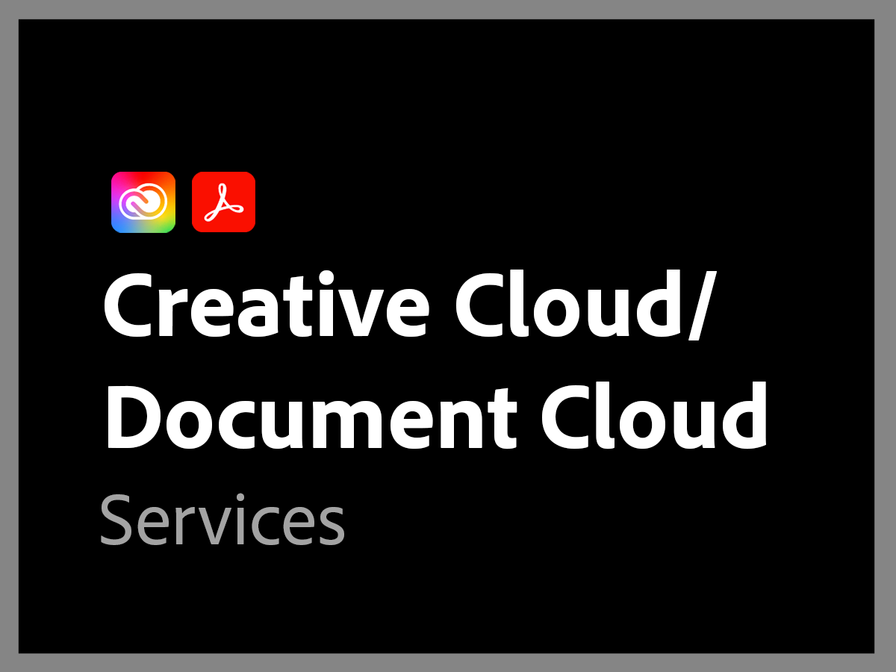

# Présentation des forfaits d’assistance Adobe précédents

>[!NOTE]
>
>Ce plan fait référence aux plans d’assistance à l’Adobe avant le 16 juin 2022. Pour consulter les plans d’assistance actuels, voir [Présentation de l’offre de prise en charge des Adobes](overview.md).

Le service d’assistance Adobe est entièrement dévoué à votre succès. Tous les abonnements comprennent un niveau d’assistance permettant un accès facile à nos ressources techniques hautement qualifiées pour l’assistance technique.

Pour répondre plus en profondeur aux besoins, nous proposons des services d’assistance Adobe comprenant l’accès à des professionnels d’assistance nommés et des sessions de tutorat proactif et d’examen du service. Peu importe la complexité de vos besoins en matière d’assistance, Adobe vous offre l’expertise technique et opérationnelle dont vous avez besoin pour atteindre des performances optimales et tirer le meilleur parti de votre solution Adobe.

<table style="table-layout:fixed">
<tr>
  <td>
    
    

    <a href="dx-overview.md"><strong>Support technique d’Experience Cloud</strong></a>
    

    
Solutions dʼassistance pour les produits Experience Cloud et Experience Platform

     
  </td>
  <td>
    
    

    <a href="dme-overview.md"><strong>Assistance pour Creative Cloud Enterprise et Document</strong></a>
    

    
Solutions dʼassistance pour les produits Creative Cloud et Document Cloud

     
  </td>
</tr>
</table>
