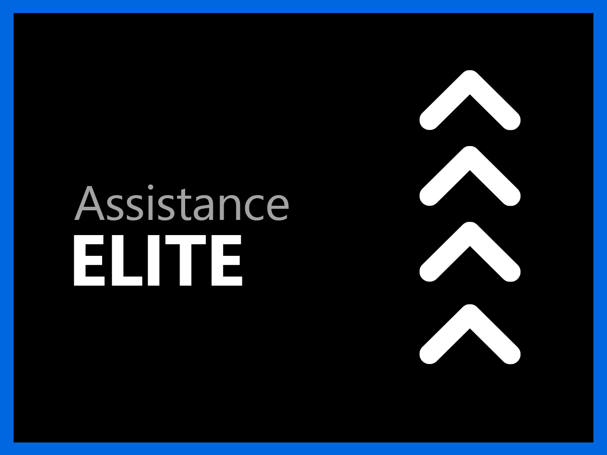

# Présentation des services d’assistance

L’organisation du service clientèle d’Adobe Experience Cloud s’engage pour votre succès. Tous les abonnements comprennent un niveau d’assistance permettant un accès facile à nos ressources techniques hautement qualifiées pour l’assistance technique.

Pour répondre plus en profondeur aux besoins, nous proposons des services d’assistance Adobe comprenant l’accès à des professionnels d’assistance nommés, des cibles de réponse accélérées de niveau de service et des sessions de tutorat proactif et d’examen du service. Peu importe la complexité de vos besoins en matière d’assistance, Adobe vous offre l’expertise technique et opérationnelle dont vous avez besoin pour atteindre des performances optimales et une valeur optimale avec votre solution Adobe.

<table style="table-layout:fixed">
<tr>
  <td>
    
    

    <a href="online.md"><strong>Assistance en ligne</strong></a> (voir <a href="assets/OnlineSupportDatasheet.pdf" target="_blank">PDF</a>)
    

    
Accès limité à l’assistance téléphonique

     
  </td>
  <td>
    
    

    <a href="business.md"><strong>Assistance commerciale</strong></a> (voir <a href="assets/BusinessSupportDatasheet.pdf" target="_blank">PDF</a>)
    

    
Accès complet aux équipes d’assistance technique d’Adobe et à une assistance principale du compte pour la gestion de compte

     
  </td>
</tr>
<tr>
  <td>
    
    

    <a href="enterprise.md"><strong>Assistance aux entreprises</strong></a> (voir <a href="assets/EnterpriseSupportDatasheet.pdf" target="_blank">PDF</a>)
    

    
Cibles de niveau de service (SLT) d’assistance améliorées, tire profit de l’expertise technique et d’un ambassadeur sous la forme d’un ingénieur d’assistance nommé

     
  </td>
  <td>
    
    

    <a href="elite.md"><strong>Assistance Elite</strong></a> (voir <a href="assets/EliteSupportDatasheet.pdf" target="_blank">PDF</a>)
    

    
Meilleures cibles de niveau de service (SLT) de leur catégorie, assistance proactive et partenariat avec un gestionnaire de compte technique et un ingénieur d’assistance nommé.

     
  </td>
</tr>
</table>

