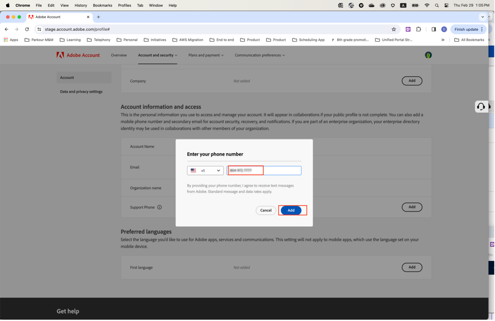

# Spécifiez le numéro de téléphone d’assistance préféré.

Lorsque vous recevez un rôle &quot;Administrateur&quot;, tel qu’un &quot;Administrateur du support produit&quot;, vous devriez recevoir un e-mail vous informant que vous disposez des droits &quot;Administrateur&quot; pour gérer l’instance pour laquelle vous avez des droits d’administrateur.

L’e-mail contient maintenant le texte en rouge ci-dessous, qui explique comment accéder à votre profil de compte et partager avec nous votre numéro de téléphone d’assistance préféré.

Pour indiquer votre numéro de téléphone préféré :

1. Cliquez sur le bouton **Profil du compte** lien pour ouvrir une nouvelle fenêtre afin de vous connecter à l’aide de `account.adobe.com`.

   

1. Suivez le processus de connexion et accédez à l’écran ci-dessous sur `account.adobe.com`.
1. Cliquez ensuite sur les onglets Compte et sécurité > Compte pour afficher le champ Numéro de téléphone de l’assistance.
1. Ajoutez ici un numéro de téléphone que vous souhaitez que nous utilisions pour vous reconnaitre en fonction de vos besoins d’assistance.

